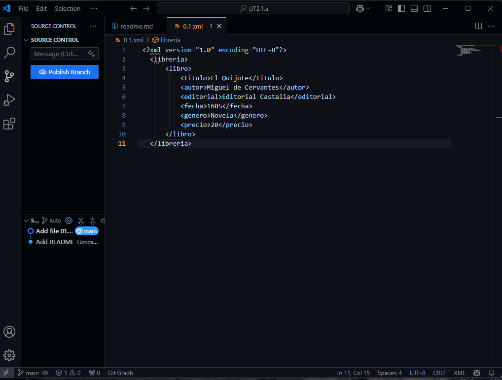
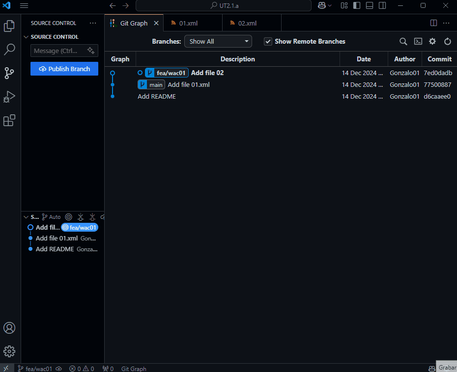
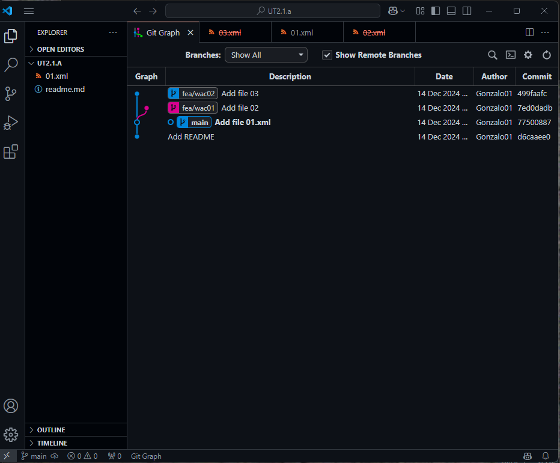

## TAREA EVALUABLE 2.1. TRABAJO CON GIT (Visual Studio Code)

### Objetivos

- Conocer cómo trabajar con GIT desde Visual Studio Code.
- Conocer el entorno de VS Code para trabajar con git.
- Conocer el lenguaje de marcado Markdown y su utilización en el desarrollo de documentación.

### Entrega

- El documento justificativo de la realización de la tarea se realizará en formato `Markdown`, el nombre del fichero será `readme.md` y estará dentro de la carpeta `UT2\TE2.1` dentro del repositorio oficial del alumno para la asignatura.

- El fichero `readme.md` debe contener los siguientes apartados:
  - Cada uno de los puntos de la tarea.
  - Explicación de los pasos realizados y una imagen/gif justificativo del paso. (las imagenes se guardarán en la carpeta `UT2\TE2.1\img`).
  - El nombre de la imagen debe ser el número del punto y subpunto seguido de la extensión correspondiente (`.png`, `.jpg`, `.gif`).
    - Ejemplo: `01.1.png`, `02.5.gif`, `03.3.jpg`.
  
- Copia este documento como plantilla para la realización de este ejercicio en tu repositorio.

### 📦 Recursos

**📁 GIT**

  - [Visualizar conceptos con D3](https://onlywei.github.io/explain-git-with-d3)
  - [Taller de introducción a GIT](https://sharp-voice-0ff.notion.site/Taller-de-introducci-n-a-git-y-GitHub-5c0269251ed9475fab606cd57b9cae34?pvs=4)
  - [Guía de supervivencia de GIT](https://sharp-voice-0ff.notion.site/GIT-Gu-a-de-supervivencia-b1ceff4f3b1040bdb27b1e39df9b4cfb?pvs=4)
  - [SOS Git](https://firstaidgit.io/#/)
  - [Escrbir en Markdown](https://docs.github.com/es/get-started/writing-on-github)
  - [Curso de GIT y GITHUB (youtube)](https://youtu.be/3GymExBkKjE)
  
    > 💡 Para obtener la url de un fichero en GIThub y que esta URL pertenezca a un commit específico, desde el navegador, desde el teclado pulsar `y` y se copia la url con el hash del commit.

**📹 GIF**

  - [ScreenToGif](https://www.screentogif.com/) grabar la pantalla y convertirlo en gif.
  

**:heavy_plus_sign: Extensiones de VSCode**

  - [Git Graph](https://marketplace.visualstudio.com/items?itemName=mhutchie.git-graph)
  - [Markdown All in One](https://marketplace.visualstudio.com/items?itemName=yzhang.markdown-all-in-one)
  - [Markdown Emoji](https://marketplace.visualstudio.com/items?itemName=bierner.markdown-emoji)

> [!NOTE]NOTA ALUMNO:
> El trabajo se ha realizado utilizando un tema oscuro de alto contraste para facilitar su lectura.<br>
> https://marketplace.visualstudio.com/items?itemName=GitHub.github-vscode-theme

### 1. Crear repositorio local y subir a GITHUB

1. Crea una carpeta llamada `UT2.1.a`.<br>
    Esta carpeta la creamos aparte del repositorio principal de la asignatura, ya que es de caracter temporal y/o para
    trabajo.

2. Inicializa un repositorio local en la carpeta `UT2.1.a`. `adjunta la imagen`<br>
   <br>
   ```markdown 
   Verificamos la creación de un repositorio de control de versiones al ver la carpeta ".git"
   ```

3. Revisa qué rama se ha creado por defecto. 쮻esde dónde los visualizas? `adjunta la imagen`<br>
   <br>
   ```markdown 
   En la parte inferior del explorador de VS, podemos ver que por defecto se crea la rama "main".
   ```

4. Renombrar la rama por defecto a `main` en caso de que tenga otro nombre. `adjunta un gif`<br>
   > [!NOTE]
   > Como hemos verificado que la rama es "main", este paso lo omitimos.
   
5. Agrega un fichero `README.md`.

   ```markdown 
   # UT2.1.a

   Repositorio de prueba para la tarea 2.1.a
   ```
    <br>


6. Agrega el fichero `README.md` al stage area. `adjunta un gif`<br>
   

7. Realiza un commit con el mensaje "Add README". `adjunta un gif`<br>
   

8. Agrega otro fichero `01.xml` con siguiente texto.

   ```xml
   <?xml version="1.0" encoding="UTF-8"?>
   <libreria>
       <libro>
           <titulo>El Quijote</titulo>
           <autor>Miguel de Cervantes</autor>
           <editorial>Editorial Castalia</editorial>
           <fecha>1605</fecha>
           <genero>Novela</genero>
           <precio>20</precio>
       </libro>
   </libreria>
   ```

9.  Agrega el fichero `01.xml` al stage area y realiza el commit "Add file 01.xml" `adjunta un gif`<br>
    

10. Agrega una nueva rama llamada `fea/wac01` con la ayuda git-graph. `adjunta un gif`<br>
    
    
11. En qué rama estas ahora mismo? 쮺칩mo sabes en qué rama estás? `adjunta la imagen` y explica en breves palabras.
    ```text
    // Respuesta
    Podemos verificar rapidamente desde el explorador de VS.
    Otra alternativa seria observar el "circulo sin reyeno" junto al nombre de la rama en GitGraph.
    O podemos abrir una terminal de GitBash desde VS.

    Ademas, estamos seguros de encontarnos en la nueva rama, ya que hemos clicado "hacer check out" durante la creación.
    ``` 
    

12. Estando en la rama `fea/wac01` agrega un fichero `02.xml`, y agrega al área de stage y realiza commit "Add file 02". `adjunta un gif`<br>

    ```xml
    <?xml version="1.0" encoding="UTF-8"?>
    <libreria>
        <libro>
            <titulo>El Hobbit</titulo>
            <autor>J.R.R. Tolkien</autor>
            <editorial>Minotauro</editorial>
            <fecha>1937</fecha>
            <genero>Fantasía</genero>
            <precio>15</precio>
        </libro>
    </libreria>
    ```
    

13. Muestra el log (pantalla de git-graph donde se visualize el commit). `adjunta la imagen`<br>
    

14. Posicionate de nuevo en la rama `main`, y crea otra rama `fea/wac02`, posicionandote directamente en ella. Agrega un fichero `03.xml`, agrega al área de stage y realiza commit "Add file 03".

    ```xml
    <?xml version="1.0" encoding="UTF-8"?>
    <libreria>
        <libro>
            <titulo>El Señor de los Anillos</titulo>
            <autor>J.R.R. Tolkien</autor>
            <editorial>Minotauro</editorial>
            <fecha>1954</fecha>
            <genero>Fantasía</genero>
            <precio>25</precio>
        </libro>
    </libreria>
    ```
     

15. Posicionate en la rama `main` y muestra los ficheros que hay en el directorio. (mostrar el arból de directorios de VS Code). `adjunta la imagen`<br>
    <br>
    > [!NOTE]
    > Observamos, que al volver atras en el tiempo al último comit en "main"; han desaparecido los archivos 02.xml y 03.xml.<br><br> Ya que no existian en este punto temporal.

16. Realizar un merge de la rama `fea/wac01` en la rama `main`. `adjunta un gif`<br>
    

17. Muestra el el log, y los ficheros que hay en el directorio. (mostrar el arból de directorios de VS Code) `adjunta la imagen`
    
    > [!NOTE]
    > Comprobamos que aparecen los archivos existentes en las ramas "main" (01.xml) y "fea/wac01" (02.xml)
    
18. Elimina la rama `fea/wac01` sin posibilidad de recuperación. `adjunta un gif`<br>
    

19. Realiza un merge de la rama `fea/wac02` en la rama `main`. `adjunta un gif`<br>
    
    
20. Muestra el log, y los ficheros que hay en el directorio. (Imagen) `adjunta la imagen`
    

21. Vuelve a la rama `fea/wac02` y modifica el fichero `03.xml` añadiendo un nuevo libro.
    
    ```xml
    <?xml version="1.0" encoding="UTF-8"?>
    <libreria>
        <libro>
            <titulo>El Señor de los Anillos</titulo>
            <autor>J.R.R. Tolkien</autor>
            <editorial>Minotauro</editorial>
            <fecha>1954</fecha>
            <genero>Fantasía</genero>
            <precio>25</precio>
        </libro>
        <libro>
            <titulo>El Silmarillion</titulo>
            <autor>J.R.R. Tolkien</autor>
            <editorial>Minotauro</editorial>
            <fecha>1977</fecha>
            <genero>Fantasía</genero>
            <precio>25</precio>
        </libro>
    </libreria>
    ```

    Agrega al área de stage y realiza commit "Update 03 file. Add book El Silmarillion".<br>
    `adjunta un gif, donde se visualize el contenido del fichero y el commit`<br>
    

22. Realiza un merge de la rama `fea/wac02` en la rama `main`. `adjunta un gif`<br>
    

23. Muestra el log del repositorio, y muestra el contenido del fichero `03.xml`. (Imagen visualizando comandos) `adjunta imagen`
    

24. Ahora, en la rama `main` modifica el fichero `03.xml` incluyendo un nuevo libro.

    ```xml
    <?xml version="1.0" encoding="UTF-8"?>
    <libreria>
        <libro>
            <titulo>El Señor de los Anillos</titulo>
            <autor>J.R.R. Tolkien</autor>
            <editorial>Minotauro</editorial>
            <fecha>1954</fecha>
            <genero>Fantasía</genero>
            <precio>25</precio>
        </libro>
        <libro>
            <titulo>El Silmarillion</titulo>
            <autor>J.R.R. Tolkien</autor>
            <editorial>Minotauro</editorial>
            <fecha>1977</fecha>
            <genero>Fantasía</genero>
            <precio>25</precio>
        </libro>
        <libro>
            <titulo>El Hobbit</titulo>
            <autor>J.R.R. Tolkien</autor>
            <editorial>Minotauro</editorial>
            <fecha>1937</fecha>
            <genero>Fantasía</genero>
            <precio>15</precio>
        </libro>
    </libreria>
    ```

    Agrega al área de stage y realiza commit "Update 03 file. Add book El Hobbit".<br>
    `adjunta un gif, donde se visualize el contenido del fichero y el commit`<br>
    

25. Agrega un nuevo fichero `04.xml` sobre libros ciencia-ficcion, en la rama `main`.

    ```xml
    <?xml version="1.0" encoding="UTF-8"?>
    <libreria>
        <libro>
            <titulo>El fin de la eternidad</titulo>
            <autor>Isaac Asimov</autor>
            <editorial>Edhasa</editorial>
            <fecha>1955</fecha>
            <genero>Ciencia ficción</genero>
            <precio>20</precio>
        </libro>
    </liberia>
    ```

    Agrega al área de stage y realiza commit "Add 04 file. Add cienca-ficcion books".<br>

26. Muestra el registro de commits (log) y los ficheros que hay en el directorio. `adjunta una imagen`<br>
    
    
27. Vuelve un commit atrás, y muestra el log y los ficheros que hay en el directorio. `adjunta un gif`<br>
    <br>
    >[!NOTE]Nota:
    > Comprobamos que al volver un commit atras, desaparece el archivo 04.xml del estado actual.
    
28. Vuelve al commit anterior, y muestra el log y los ficheros que hay en el directorio. `adjunta un gif`<br>
    <br>
    >[!NOTE]Nota:
    > Al volver un 2º commit atras en el tiempo (antes de añadir "El Hobbit"), vemos que el archivo 03.xml se restablece al estado anterior al commit.

29. Posicionate de nuevo en el último commit, y muestra el log y los ficheros que hay en el directorio. `adjunta un gif`
    

### 2. Crear repositorio remoto y subir a GITHUB

1. Crea un repositorio remoto en GITHUB llamado `EEDD_{NombreApellido}_TE2.1` público, vacio, sin nada.
   
2. Agrega el repositorio remoto a tu repositorio local. Explica cómo lo haces, y `adjunta una imagen donde se visualizen las url's`<br>
    <br>

   ```text
    // Comentario - Para realizar esta tarea:

     1. Abrimos el explorador del control de versiones 
     2. Abrimos el desplegable de fuentes de versiones (source)
     3. Submenú "Remote" => Add Remote
     4. En la linea de comandos superior nos preguntara la url y el nombre del repositorio remoto.
    ```
    <br>
    <br>
    <br>
    ``` 
    Fé de erratas: Nos muestra el mensaje de "Nombre en uso", debido a que he vuelto a repetir el proceso para mostrar la captura de url/nombre.
    ```

    > [!NOTE]Nota:
    > Como podemos observar, no es necesario que el repositorio local y el remoto se llamen igual. Tan solo es necesario realizar correctamente el enlazado de la URL o protocolo SSH

3. Sube la rama `main` al repositorio remoto. `adjunta un gif`<br>
    
   

4. Posicionate en la rama `fea/wac02` y sube la rama `fea/wac02` al repositorio remoto. `adjunta un gif`<br>
    

5. Ahora desde GITHUB (web) en la rama `fea\wac02`, modifica el fichero `03.xml` añadiendo un nuevo libro.

   ```xml
   <?xml version="1.0" encoding="UTF-8"?>
   <libreria>
       <libro>
           <titulo>El Señor de los Anillos</titulo>
           <autor>J.R.R. Tolkien</autor>
           <editorial>Minotauro</editorial>
           <fecha>1954</fecha>
           <genero>Fantasía</genero>
           <precio>25</precio>
       </libro>
       <libro>
           <titulo>El Silmarillion</titulo>
           <autor>J.R.R. Tolkien</autor>
           <editorial>Minotauro</editorial>
           <fecha>1977</fecha>
           <genero>Fantasía</genero>
           <precio>25</precio>
       </libro>
       <libro>
           <titulo>El Hobbit</titulo>
           <autor>J.R.R. Tolkien</autor>
           <editorial>Minotauro</editorial>
           <fecha>1937</fecha>
           <genero>Fantasía</genero>
           <precio>15</precio>
       </libro>
       <libro>
           <titulo>El hombre bicentenario</titulo>
           <autor>Isaac Asimov</autor>
           <editorial>Edhasa</editorial>
           <fecha>1976</fecha>
           <genero>Ciencia ficción</genero>
           <precio>20</precio>
   </libreria>
   ```

   Realiza un commit con el mensaje "Update 03 file. Add book El hombre bicentenario".
   (Muestra pantallazo de GITHUB con el commit realizado) `adjunta la imagen`
   

6. Ahora obten los cambios sin acualizar el repositorio local (`git fetch origin`).<br>
   Muestra el log del repositorio local `adjunta la imagen`
   
    
7.  Ahora actualiza el repositorio local con los cambios del repositorio remoto (`git pull`) y muestra el log. `adjunta un gif`<br>
    
    >[!NOTE]Nota:
    > Cuando nos pregunta si queremos posicionar el remoto en la rama fea/wac02, pulsamos Sí.
    > Se realiza otro commit corrigiendo errores de Syntasis en el ficheros 03 xml.
    > Ya que ese error se corrigio en la rama main y no en la fea/wac2

8.  Haz un merge de la rama `fea/wac02` en la rama `main`. Muestra estado, log, y el contenido fichero `03.xml`
   >[!NOTE]Nota:
   > Se realizan los apartados 8 y 9 en el mismo gif. El cual incluye el aceptar los cambios de la version corregida.

9.  Sube la rama `main` al repositorio remoto. `adjunta una gif`<br> (Incluye imagen) `adjunta un gif`<br>
    

10. Elimina la rama local `fea/wac02` sin posibilidad de recuperación. `adjunta un gif`<br>
    

11. Elimina la rama remota `fea/wac02` sin posibilidad de recuperación 
    
    
12. Muestra desde GITHUB (navegador web) las ramas que tienes el en repositorio remoto. `adjunta un gif`<br>
    

13. Para finalizar, muestra el log del repositorio local (Incluye imagen) `adjunta la imagen`<br>
    

### 3. Enlace repositorio remoto

1. Incluye el enlace al repositorio remoto en este punto para que el profesor pueda acceder a él.
   ```text
   https://github.com/glavadoj01/EEDD_GonzaloLavado_TE2.1 
    ``` 
