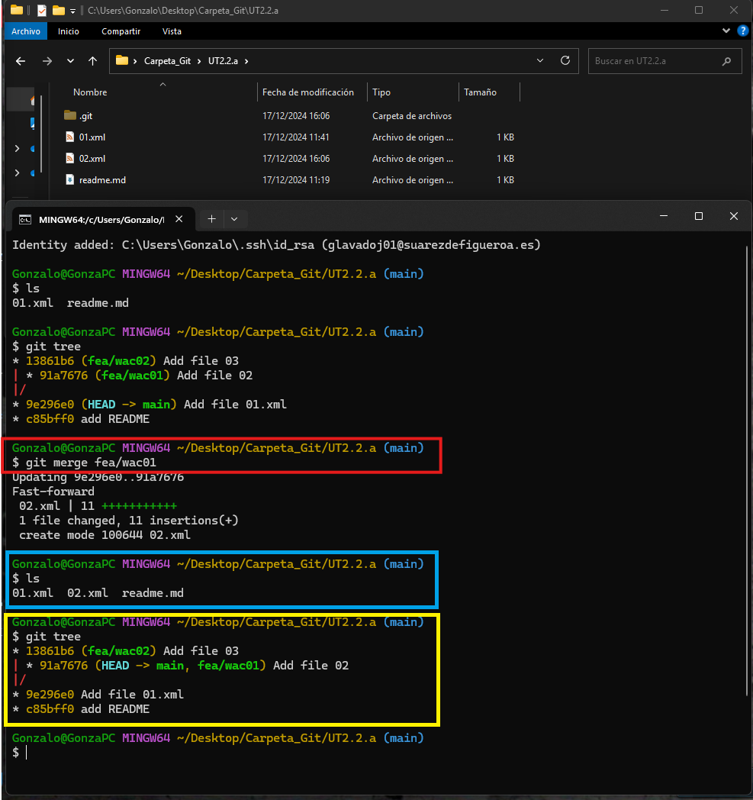
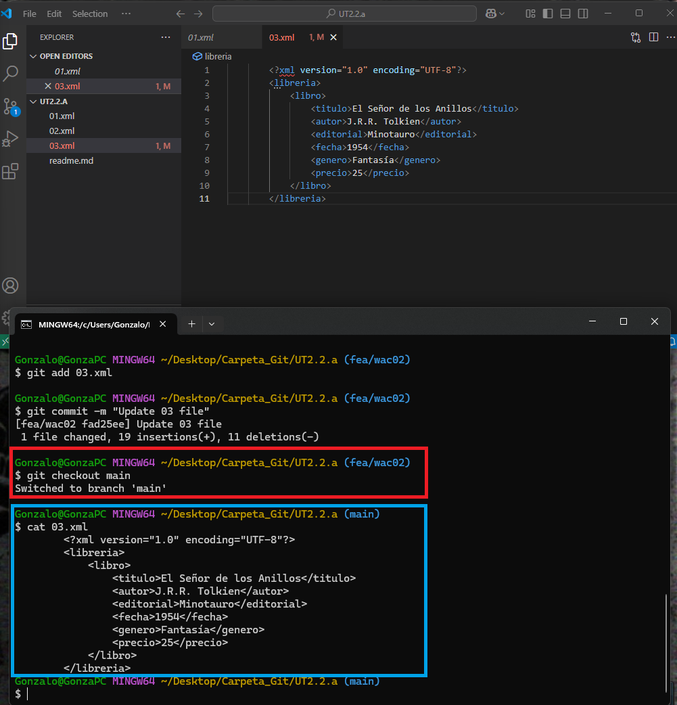
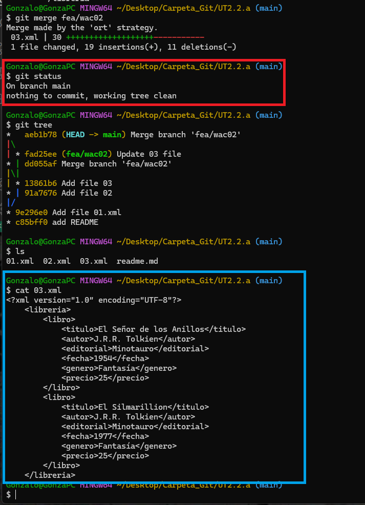

## TAREA EVALUABLE 2.2. TRABAJO CON GIT (Comandos)

### Objetivos

- Conocer los comandos de git más importantes para trabajar con repositorios locales y remotos.
- Conocer el entorno de VS Code para trabajar con git.
- Conocer el lenguaje de marcado Markdown y su utilización en el desarrollo de documentación.

### Entrega

- El documento justificativo de la realización de la tarea se realizará en formato `Markdown`, el nombre del fichero será `readme.md` y estará dentro de la carpeta `UT2\TE2.2` dentro del repositorio oficial del alumno para la asignatura.

- El fichero `readme.md` debe contener los siguientes apartados:
    - Cada uno de los puntos de la tarea.
    - Explicación de los pasos realizados y una imagen/gif justificativo del paso. (las imagenes se guardarán en la carpeta `UT2\TE2.2\img`).
    - El nombre de la imagen debe ser el número del punto y subpunto seguido de la extensión correspondiente (`.png`, `.jpg`, `.gif`).
      - Ejemplo: `01.1.png`, `02.5.gif`, `03.3.jpg`.

- Copia este documento como plantilla para la realización de este ejercicio en tu repositorio.

### 📦 Recursos

**📁 GIT**

  - [Visualizar conceptos con D3](https://onlywei.github.io/explain-git-with-d3)
  - [Taller de introducción a GIT](https://sharp-voice-0ff.notion.site/Taller-de-introducci-n-a-git-y-GitHub-5c0269251ed9475fab606cd57b9cae34?pvs=4)
  - [Guía de supervivencia de GIT](https://sharp-voice-0ff.notion.site/GIT-Gu-a-de-supervivencia-b1ceff4f3b1040bdb27b1e39df9b4cfb?pvs=4)
  - [SOS Git](https://firstaidgit.io/#/)
  - [Escrbir en Markdown](https://docs.github.com/es/get-started/writing-on-github)
  - [Curso de GIT y GITHUB (youtube)](https://youtu.be/3GymExBkKjE)
  
    > 💡 Para obtener la url de un fichero en GIThub y que esta URL pertenezca a un commit específico, desde el navegador, desde el teclado pulsar `y` y se copia la url con el hash del commit.

**📹 GIF**

  - [ScreenToGif](https://www.screentogif.com/) grabar la pantalla y convertirlo en gif.
  

**:heavy_plus_sign: Extensiones de VSCode**

  - [Git Graph](https://marketplace.visualstudio.com/items?itemName=mhutchie.git-graph)
  - [Markdown All in One](https://marketplace.visualstudio.com/items?itemName=yzhang.markdown-all-in-one) DESINSTALADO (NO ES NECESARIO PARA LA WEB)
  - [Markdown Emoji](https://marketplace.visualstudio.com/items?itemName=bierner.markdown-emoji) DESINSTALADO (NO SE VE EN LA WEB QUE ES DONDE SE CORRIGE Y VISUALIZA)
  

### 1. Crear repositorio local y subir a GITHUB

1. Crea una carpeta llamada `UT2.2.a`.

2. Inicializa un repositorio local en la carpeta `UT2.2.a`. ¿Qué comando/s utilizas?
   ```text
    // Respuesta:
    Tras abrir una terminal de GitBash en el directorio en cuestión (bien por acceso directo del menú contextual o mediante el posicionamiento manual con la orden "cd /RUTA"), inicializamos un repositorio de control de versiones con la orden "git init".
    ``` 
    <br>
3. Revisa qué rama se ha creado por defecto. ¿Qué comando/s utilizas?
    ```text
    // Respuesta:
    - Al trabajar con GitBash vemos directamente en que rama estamos en cada momento. 
    - Para una terminal cualquiera el comando sería "git status".
    ``` 
    <br>
4. Renombrar la rama por defecto a `main` en caso de que tenga otro nombre. ¿Qué comando/s utilizas?
   ```text
    // Respuesta:
    Como hemos visto en el punto 3, por defecto se crea la rama "main". En cualquier caso, el comando sería(sin comillas): "git branch -m new-name"
    ``` 
5. Agrega un fichero `README.md`.
   ```markdown
    # UT2.2.a

        Repositorio de prueba para la tarea 2.2.a
   ```
   <br>
6. Agrega el fichero `README.md` al stage area. ¿Qué comando/s utilizas?
   ```text
    // Respuesta:
    Tenemos 2 opciones: Especificar el nombre del archivo, o seleccionar todos (ya que solo hay 1) con la abreviatura "." (punto).
        git add .
        git add readme.md

    Verificamos con "git status"
    ```
    <br>
7. Realiza un commit con el mensaje "Add README". ¿Qué comando/s utilizas?
   ```text
    // Respuesta:
    Utilizamos el comando:      git commit -m "Add README"
    ```
    <br> 
8. Agrega otro fichero `01.xml` con siguiente texto.
   ```xml
        <?xml version="1.0" encoding="UTF-8"?>
        <libreria>
            <libro>
                <titulo>El Quijote</titulo>
                <autor>Miguel de Cervantes</autor>
                <editorial>Editorial Castalia</editorial>
                <fecha>1605</fecha>
                <genero>Novela</genero>
                <precio>20</precio>
            </libro>
        </libreria>
   ```
   <br>
9.  Agrega el fichero `01.xml` al stage area y realiza el commit "Add file 01.xml" ¿Qué comando/s utilizas?
    ```text
    // Respuesta:
    Volvemos a utilizar el comando:     git add Nombre_archivo
    Y tambien el comando:               git commit -m "Mensaje"
    ```
    <br>
10. Agrega una nueva rama llamada y posicionate directamente en ella con el mismo comando `fea/wac01`. ¿Qué comando/s utilizas? (busca en internet si no lo recuerdas)
    ```text
    // Respuesta:
    Para crear una rama(sin simbolos de apertura/cierre): git branch <Nombre>
    Para crear y posicionar directamente en una rama: git checkout -b <Nombre>
    ```
    <br>
11. En qué rama estas ahora mismo? ¿Qué comando/s utilizas?
    ```text
    // Respuesta:
    Ante la duda, y si no estuvieramos utilizando GitBash; y si no hubieramos seleccionado la opcion de crear y posicionar:
        git status
    ```
    <br>
12. Estando en la rama `fea/wac01` agrega un fichero `02.xml, y agrega al área de stage y realiza commit "Add file 02".
    ```xml
        <?xml version="1.0" encoding="UTF-8"?>
        <libreria>
            <libro>
                <titulo>El Hobbit</titulo>
                <autor>J.R.R. Tolkien</autor>
                <editorial>Minotauro</editorial>
                <fecha>1937</fecha>
                <genero>Fantasía</genero>
                <precio>15</precio>
            </libro>
        </libreria>
    ```
    <br>
    <br>
13. Muestra el log utilizando solo una línea por commit con opciones gráficas. ¿Qué comando/s utilizas?
    ```text
    // Respuesta:
    - Para visualizar el log:                 git log
    - Para visualizar una linea por commit:   git log --oneline
    - Para visualizar opciones gráficas:      git log --graph
    Las subopciones son aditivas.
    ```
    Nota:
    Tambien contamos con el método abreviado de MourDev:
    <br>&emsp;&emsp;git tree
    <br>&emsp;&emsp;git log --graph --decorate --all --oneline
    <br>Ref: https://www.youtube.com/watch?v=3GymExBkKjE&t=3782s
    <br>
14. Posicionate de nuevo en la rama `main`, y crea otra rama `fea/wac02`, posicionandote directamente en ella. Agrega un fichero `03.xml`, agrega al área de stage y realiza commit "Add file 03".
    ```xml
        <?xml version="1.0" encoding="UTF-8"?>
        <libreria>
            <libro>
                <titulo>El Señor de los Anillos</titulo>
                <autor>J.R.R. Tolkien</autor>
                <editorial>Minotauro</editorial>
                <fecha>1954</fecha>
                <genero>Fantasía</genero>
                <precio>25</precio>
            </libro>
        </libreria>
    ```
    ```text
    // Respuesta:
        git checkout main
        git checkout -b fea/wac02

    Verificamos que "ha desaparecido" el archivo "02.xml", dado que se desarrolló en la rama "fea/wac01" y esta rama la hemos creado a partir de la rama "main".
    ```
    <br>
    ```text
    //Respuesta:
        # Creamos el fichero con la información
        git add 03.xml
        git commit -m "Add file 03"
    ```
    <br>
    <br>
15. Posicionate en la rama `main` y muestra los ficheros que hay en el directorio. ¿Qué comando/s utilizas?
    ```text
    // Respuesta:
        git checkout main
        ls

    Verificamos que solo existe el archivo "01.xml" en este estado, ademas del README.
    ```
    <br>
    <br>
16. Realizar un merge de la rama `fea/wac01` en la rama `main`. (Indica los comandos utilizados y explica cada uno de ellos).
    ```text
    // Respuesta:
        git merge <branch-name>
        ls
        git tree

    - Con el 1º comando (rojo), vamos a fusionar la rama nombrada, en la rama actual (en nuestro caso, vamos a fusionar fea/wac01 en main, siendo main la que recibe y fusiona contenido, mientras que "fea/wac01" quedara tal como esté).
    - Con el 2º comando(celeste) verificamos el contenido actual del directorio (readme + 01 + 02).
    - Con el 3º comando(amarillo) verificamos el estado gráfico de los commits y ramas.
    ```
    <br>
    Nota:
    Cuando lanzamos el "merge", podemos especificar un mensaje para el commit, en este caso (y casi siempre, salvo que se requiera informacion adicional/especifica para la fuisión), se opta por el mensaje por defecto:
     <br><br>&emsp;&emsp;merge branch '<Nombre_Rama>'<br><br>
    En caso de no especificar un mensaje para el "commit" del "merge" (como en este caso), se abrira una ventana adicional para confirmar el mensaje por defecto, o tener una 2ª oportunidad de añadir un mensaje/commit especifico. Para confirmar simplemente cerrar la ventana.
17. Muestra el estado del repositorio, el log, y los ficheros que hay en el directorio. (Imagen/gif visualizando los comandos) `adjunta la imagen`
    ```text
    // Respuesta:
    Pasos realizados preventivamente en el apartado anterior.
    Corresponden al "3º comando" (log gráfico en rojo) y al "2º comando" (contenido actual del directorio en amarillo)
    ```
18. Elimina la rama `fea/wac01` sin posibilidad de recuperación. ¿Qué comando/s utilizas?
    ```text
    // Respuesta:
    Tenemos 2 opciones:
        git branch -d nombre-de-rama
        git branch -D nombre-de-rama

    La opcion "-d" tiene como requisito de seguridad, que no podrás eliminar una rama si aún no has hecho el merge de los cambios de esa rama con la rama principal.
    Mientras que la opción "-D" fuerza la eliminación, haya sido o no fusionada
    ⚠⚠¡CUIDADO!⚠⚠
    ```
    <br>
19. Realiza un merge de la rama `fea/wac02` en la rama `main`.
    ```text
    // Respuesta:
        git merge fea/wac02

    Dado que ya nos encontramos en la rama "main", no es necesario nada más. Si no,  primero hay que posicionarse en la rama que va a "recibir" el merge.
    ```
    <br>
20. Muestra el estado del repositorio, el log, y los ficheros que hay en el directorio. (Imagen) `adjunta la imagen`
    ```text
    // Respuesta:
    En azul:        git status
    En amarillo:    git tree
    En fuscia:      ls

    Verificamos tanto en el arbol (bloque git tree) como en el contenido del directorio (bloque ls) que el estado actual de MAIN contiene todos los ficheros de las diversas ramas que han sido fusionadas.
    ```
    <br>
21. Vuelve a la rama `fea/wac02` y modifica el fichero `03.xml` añadiendo un nuevo libro.
    ```xml
    <?xml version="1.0" encoding="UTF-8"?>
    <libreria>
        <libro>
            <titulo>El Señor de los Anillos</titulo>
            <autor>J.R.R. Tolkien</autor>
            <editorial>Minotauro</editorial>
            <fecha>1954</fecha>
            <genero>Fantasía</genero>
            <precio>25</precio>
        </libro>
        <libro>
            <titulo>El Silmarillion</titulo>
            <autor>J.R.R. Tolkien</autor>
            <editorial>Minotauro</editorial>
            <fecha>1977</fecha>
            <genero>Fantasía</genero>
            <precio>25</precio>
        </libro>
    </libreria>
    ```
    Agrega al área de stage y realiza commit "Update 03 file. Add book El Silmarillion".
    ```text
    // Respuesta:
        git checkout fea/wac02
        # EDICION DEL ARCHIVO
    Primero ejecutamos el comando "git checkout fea/wac02" para posicionar el directorio en el estado de esa rama. Tras esto, editamos y guardamos el archivo 03.xml.
    ```
    <br>
    ```text

        git add 03.xml
        git commit -m "Update 03 file"
    Agregamos el archivo al área de espera y realizamos el commit.
    ```
    <br>
    Nota:
    En VS podemos verificar en que rama estamos (parte inferior izquierda) y el contenido actual del directorio (explorador lateral).
22. Posicionate en la rama `main`, muestra el estado y muestra el contenido del fichero `cat 03.xml`. (Imagen visualizando comandos) `adjunta la imagen`
    ```text
    //Respuesta
        git checkout main
        cat 03.xml

    Con el 1º comando(rojo) nos posicionamos en el estado de la rama MAIN.
    Con el 2º comando(celeste) vemos en consola el contenido del archivo especificado

    Observamos que, logicamente la rama MAIN, no contiene los cambios realizados en la rama fea/wac02.
    ```
    <br>
23. Realiza un merge de la rama `fea/wac02` en la rama `main`. ¿Qué comando/s utilizas?
    ```text
    // Respuesta:
        git merge fea/wac02

    Dado que en el punto anterior nos habiamos posicionado en la rama MAIN, podemos realizar la fusión directamente.
    Ahora el archivo 03 de la rama MAIN, sí contiene el 2º libro añadido en la rama "fea/wac02" (todos los cambios syncronizados).
    Se vuelve a optar por el mensaje/commit por defecto para el "merge":  merge branch 'fea/wac02'
    ```
    <br>
24. Muestra el estado del repositorio, y muestra el contenido del fichero `03.xml`. (Imagen visualizando comandos) `adjunta la imagen`
    <br>

25. Ahora, en la rama `main` modifica el fichero `03.xml` incluyendo un nuevo libro.
    ```xml
    <?xml version="1.0" encoding="UTF-8"?>
    <libreria>
        <libro>
            <titulo>El Señor de los Anillos</titulo>
            <autor>J.R.R. Tolkien</autor>
            <editorial>Minotauro</editorial>
            <fecha>1954</fecha>
            <genero>Fantasía</genero>
            <precio>25</precio>
        </libro>
        <libro>
            <titulo>El Silmarillion</titulo>
            <autor>J.R.R. Tolkien</autor>
            <editorial>Minotauro</editorial>
            <fecha>1977</fecha>
            <genero>Fantasía</genero>
            <precio>25</precio>
        </libro>
        <libro>
            <titulo>El Hobbit</titulo>
            <autor>J.R.R. Tolkien</autor>
            <editorial>Minotauro</editorial>
            <fecha>1937</fecha>
            <genero>Fantasía</genero>
            <precio>15</precio>
        </libro>
    </libreria>
    ```
    Agrega al área de stage y realiza commit "Update 03 file. Add book El Hobbit".
    ```text
    // Respuesta:
        # EDICION DEL ARCHIVO
        git add 03.xml
        git commit -m "Update 03 file. Add book El Hobbit"
    ```
    <br>
    <br>
26. Agrega un nuevo fichero `04.xml` sobre libros ciencia-ficcion, en la rama `main`.
    ```xml
    <?xml version="1.0" encoding="UTF-8"?>
    <libreria>
        <libro>
            <titulo>El fin de la eternidad</titulo>
            <autor>Isaac Asimov</autor>
            <editorial>Edhasa</editorial>
            <fecha>1955</fecha>
            <genero>Ciencia ficción</genero>
            <precio>20</precio>
        </libro>
    </liberia>
    ```
    Agrega al área de stage y realiza commit "Add 04 file. Add cienca-ficcion books".
    ```text
    // Respuesta:
        # EDICION DEL ARCHIVO
        git add 04.xml
        git commit -m "Add 04 file. Add ciencia-ficción books"


        # 2ª Edicción: "liberia" to "libreria" at line 11
        git add 04.xml
        git commit -m "Fix 04 file"
    ```
    <br>
    <br>
    <br>
27. Muestra el estado, log una línea y los ficheros que hay en el directorio. (Imagen visualizando comandos) `adjunta la imagen`
    <br>    
28. Vuelve un commit atrás, y muestra el estado, log una línea y los ficheros que hay en el directorio. (Imagen visualizando comandos) `adjunta la imagen`
    ```text
    // Respuesta:
        git checkout <CommitHash>
    En este caso, para el commit "Update 03 file":
        git checkout 4a6dc45

    Rojo:       Checkout al último commit
    Celeste:    Estado
    Amarillo:   Log gráfico con una línea por commit
    Fuscia:     Contenido del directorio
    ```
    <br>
29. Vuelve al commit anterior, y muestra el estado, log una línea y los ficheros que hay en el directorio. (Imagen visualizando comandos) `adjunta la imagen`
    ```text
    // Respuesta:
    En este caso, para el commit "merge branch 'fea/wac02'":
        git checkout aeb1b78

    Rojo:       Checkout al último commit
    Celeste:    Estado
    Amarillo:   Log gráfico con una línea por commit
    Fuscia:     Contenido del directorio
    ```
    <br>
30. Posicionate de nuevo en el último commit, y muestra el estado, log una línea y los ficheros que hay en el directorio. (Imagen visualizando comandos) `adjunta la imagen`
    ```text
    // Respuesta:
    En este caso, para el commit "Fix 04 file":
        git checkout 5f2569f

    Rojo:       Checkout al último commit
    Celeste:    Estado
    Amarillo:   Log gráfico con una línea por commit
    Fuscia:     Contenido del directorio y del archivo 04.xml
    ```
    <br>
    ```text
    Con esto nos encontramos con el problema de que el commit "5f2569f (Fix 04 file)" está debidamente cargado como el estado actual; pero, no está marcado como "HEAD->MAIN"; 
    si no como un commit especifico que en este momento; coincide con el estado MAIN, pero que hemos cargado de forma especifica, de ahí la discrepancia. 
    Para solucionarlo basta con hacer (ahora, o desde un principio):
        git checkout MAIN

    La diferencia entre los dos estados, la podemos ver en el arbol gráfico (recuadro naranja); ya que cuando estabamos en el commmit "5f2569f", se diferenciaban dos estados 
    identicos; uno como HEAD (estado actual cargado como commit 5f2569f) y otro como MAIN (estado identico, pero no cargado). Mientras que ahora, podemos ver la flecha que indica que el estado HEAD es tambien el estado MAIN.

    Esto se debe principalmente, a que llamar a un commit por su hash, se llama a la imagen estatica en el tiempo con ese hash, mientras que la llamada al commit/estado MAIN, llama al estado dinamico que ira evolucionando según dictamine el usuario.
    ```
    <br>
### 2. Crear repositorio remoto y subir a GITHUB
1. Crea un repositorio remoto en GITHUB llamado `EEDD_{NombreApellido}_TE2.2` público, vacio, sin nada.
    <br>
2. Agrega el repositorio remoto a tu repositorio local. ¿Qué comando/s utilizas?
   ```text
    // Respuesta:
        git remote add origin https://github.com/glavadoj01/EEDD_GonzaloLavado_TE2.2.git
    ```
    <br>
3. Muestra los repositorios remotos que tienes configurados. ¿Qué comando/s utilizas?
   ```text
    // Respuesta:
        git remote -v
    ```
    <br>
4. Sube la rama `main` al repositorio remoto. ¿Qué comando/s utilizas?
   ```text
    // Respuesta:
        git push origin main
    ```
    <br>
5. Muestra el log de la rama `main` con opciones gráficas. ¿Qué comando/s utilizas?
   ```text
    // Respuesta:
        git tree
        git log --oneline --graph --decorate --all
    ```
    <br>
6. Posicionate en la rama `fea/wac02` y sube la rama `fea/wac02` al repositorio remoto. ¿Qué comando/s utilizas?
   ```text
    // Respuesta:
        git checkout fea/wac02
        git push origin fea/wac02
    ```
    <br>
7. Ahora desde GITHUB (web) en la rama `fea\wac02`, modifica el fichero `03.xml` añadiendo un nuevo libro.
   ```xml
   <?xml version="1.0" encoding="UTF-8"?>
   <libreria>
       <libro>
           <titulo>El Señor de los Anillos</titulo>
           <autor>J.R.R. Tolkien</autor>
           <editorial>Minotauro</editorial>
           <fecha>1954</fecha>
           <genero>Fantasía</genero>
           <precio>25</precio>
       </libro>
       <libro>
           <titulo>El Silmarillion</titulo>
           <autor>J.R.R. Tolkien</autor>
           <editorial>Minotauro</editorial>
           <fecha>1977</fecha>
           <genero>Fantasía</genero>
           <precio>25</precio>
       </libro>
       <libro>
           <titulo>El Hobbit</titulo>
           <autor>J.R.R. Tolkien</autor>
           <editorial>Minotauro</editorial>
           <fecha>1937</fecha>
           <genero>Fantasía</genero>
           <precio>15</precio>
       </libro>
       <libro>
           <titulo>El hombre bicentenario</titulo>
           <autor>Isaac Asimov</autor>
           <editorial>Edhasa</editorial>
           <fecha>1976</fecha>
           <genero>Ciencia ficción</genero>
           <precio>20</precio>
   </libreria>
   ```
   Realiza un commit con el mensaje "Update 03 file. Add book El hombre bicentenario".
   (Muestra pantallazo de GITHUB con el commit realizado) `adjunta la imagen`
    ```text
    // Respuesta:
    Debido a que El Hobbit se añade durante la rama MAIN, esta rama, solo cuenta con dos libros. Por lo que efectivamente añadimos 2 libros "El hobbit" y "El hombre bicentenario", aunque al igual que en la actividad 2.1.a, esté último libro debería ir en el archivo 04.xml (ciencia-ficción) en vez del 03.xml (fantasia o bibliografia Tolkien, no me termina de quedar claro).

    Sea como fuere, se aprovecha para darle buen formato/alineación tras los diversos copia/pega, ademas de corregir los fallos syntacticos (falta 1 etiqueta en 03 y otra en 04 está mal escrita); exactamente los mismos fallos que en la actividad 2.1.a, por lo que se preveen conflictos a la hora de fusionar con la rama principal tras estas edicciones, ya que se han modificado todas las líneas.
    ```
    <br>
8. Ahora obten los cambios sin acualizar el repositorio local (`git fetch origin`).
    <br>
9.  Muestra un log del repositorio local con opciones gráficas. (Incluye imagen) `adjunta la imagen`
    <br>    
10. Ahora actualiza el repositorio local con los cambios del repositorio remoto (`git pull origin fea/wac02`).
    <br>    
11. Muestra un log del repositorio local con opciones gráficas. (Incluye imagen) `adjunta la imagen`
    <br>
12. Haz un merge de la rama `fea/wac02` en la rama `main`. Muestra estado, log, y el contenido fichero `03.xml` (Incluye imagen) `adjunta la imagen`
    ```text
    // Respuesta
        git checkout main
        git merge fea/wac02
        # Resolucion del conflicto (Preveeido) en VS: Se acepta el contenido entrante (obviamente, ya que es la versión corregida al completo)
        git add 03.xml
        git commit -m "Resolve Merge Conflicts"
        git status
        git tree
        cat 03.xml
    ```
    <br>
    <br>
    <br>
    <br>
13. Sube la rama `main` al repositorio remoto. ¿Qué comando/s utilizas?
    ```text
    // Respuesta
        git push origin main

    Aunque, al estar posicionados en la rama que queremos subir, y al subirla a la rama origen (remoto), bastaria con introduccir "git push", ya que el resto de valores (origin main) se autocompletarian con las opciones por defecto (<origin> <rama actual>).
    ```
    <br>
14. Elimina la rama local `fea/wac02` sin posibilidad de recuperación. ¿Qué comando/s utilizas?
    ```text
    // Respuesta
        git branch -d fea/wac02
    ```
    <br>
15. Elimina la rama remota `fea/wac02` sin posibilidad de recuperación (git push origin --delete fea/wac02).
    ```text
    // Respuesta
        git push origin -d fea/wac02
    ```
    <br>
16. Muestra desde GITHUB (navegador web) las ramas que tienes el en repositorio remoto. (Incluye imagen) `adjunta la imagen`
    <br>
17. Para finalizar, muestra el log del repositorio local con opciones gráficas. (Incluye imagen) `adjunta la imagen`
    <br>


    COLORARIO 1:<br>
        Se puede observar, que he ido subiendo (haciendo push), con distintos usuarios (Gonzalo01: Gonzalo@GonzaPC; y Gonzalo_IES: Alumno_ciclo@PC-FP).
        Esto es posible, gracias a que tengo bien configurado la syncronizacion de mi carpeta local. Siendo completamente indiferente el pc en el que me encuentre. Siempre tengo el último estado local syncronizado/distribuido en mi nube personal. Por lo que cuando entro en mi carpeta/nube personal, git lee y carga la información/estado almacenada en la carpeta. Manteniendo el historico de commits y cambios que se hayan tanto en local (mi nube personal), como en remoto (en GitHub).
        La unica diferencia, es que cuando hago push de local a remoto, se enviará el nombre de un pc u otro (información contenida en el archivo .gitconfig de la carpeta user).

    COLORARIO 2:<br>
        No uso la nube de Google. Utilizo OneDrive versión de pago desde antes de este curso. Por lo que antes se me acaba el espacio de almacenamiento de GitHub que el de mi nube personal.

    COLORARIO 3:<br>
        Si por motivos de privacidad no puedo subir información a la nube de Google o Microsoft, dudo mucho que pueda subirlas a la nube de GitHub. Habria que estudiar la casuistica de cada proyecto y la metodologia de trabajo de las empresas en la que nos encontremos y adaptarnos a los requerimientos.
        Mientras tanto, todo mí contenido acádemico de años está, y estará, en mi nube personal.

### 3. Enlace repositorio remoto

1. Incluye el enlace al repositorio remoto en este punto para que el profesor pueda acceder a él.
   ```text
    // Enlace al repositorio remoto (el que aparece en la URL del navegador)
        https://github.com/glavadoj01/EEDD_GonzaloLavado_TE2.2
    ``` 
