# TE3.1 - Configuraci贸n de Eclipse y JetBrains IntelliJ IDEA

En esta tarea de aprendizaje, aprender谩s a instalar el JDK y JREs en Windows y Linux, y a configurar Eclipse y JetBrains IntelliJ IDEA.

## Recursos

- [Instalaci贸n del JDK en Linux](https://docs.oracle.com/javase/8/docs/technotes/guides/install/linux_jdk.html)
- [Instalaci贸n del JDK en Windows](https://docs.oracle.com/javase/8/docs/technotes/guides/install/windows_jdk_install.html)

### Objetivos

- Conocer c贸mo instalar el JDK/JRE en Windows y Linux.
- Conocer c贸mo configurar Eclipse y JetBrains IntelliJ IDEA para utilizar un JDK.
- Conocer c贸mo configurar Windows y Linux a nivel de sistema para utilizar diferentes versiones de Java.
- Conocer c贸mo instalar y usar la herramienta SDKMan para instalar diferentes versiones de Java en Linux/MacOS/Windows.

### Recursos

**GIF Videos**

- [Software crear GIFs animados para Windows](https://www.screentogif.com/)
- [Software crear GIFs animados para Linux](https://github.com/phw/peek)
- [Herramienta Online GIF](https://ezgif.com/video-to-gif)

### Entrega

El documento justificativo de la realizaci贸n de la tarea se realizar谩 en formato `Markdown`, el nombre del fichero ser谩 `readme.md` y estar谩 dentro de la carpeta `UT3\TE3.1` dentro del repositorio oficial del alumno para la asignatura.

El fichero `readme.md` debe contener los siguientes apartados:

- Cada uno de los puntos de la tarea.

### 1. Configuraci贸n de Java en Windows y Linux

1. Revisa la configuraci贸n de tu m谩quina a trav茅s del terminal e indica la versi贸n de Java que tienes instalada.

```bash
# Comprueba la versi贸n de Java instalada
$> java -version
# Comprueba donde est谩 instalado Java
$> where java
# Busca todas las versiones de Java instaladas
$> which java
```
 _Adjunta una imagen de los comandos anteriores y responde a las siguientes preguntas_

   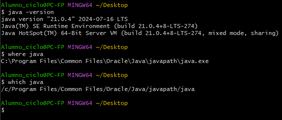

   驴Qu茅 versi贸n de Java tienes instalada?

      Java 21.0.4

   驴Cuantas versiones de Java tienes instaladas? 驴Por qu茅?

      Una, por que hasta ahora, nunca he necesitado m谩s. As铆 que siempre me aseguraba de mantener solo la versi贸n que utilizo.

   Si tienes m谩s de una versi贸n indica todas las versiones y rutas de instalaci贸n.

      Java 21.0.4 =>   C:\Program Files\Commen Files\Oracle\Java\javapath\java.exe

2. Variables de entorno.

    _Adjunta una imagen de las variables de entorno de tu sistema, tanto a nivel de usuario como a nivel de sistema._
   - Muestra a trav茅s de interfaz (Ventana de windows) (Usuarios y sistema)
      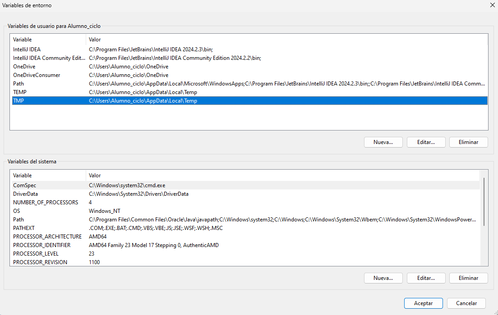

   - Muestra a nvel de comandos (Solo usuario) (`set`)
      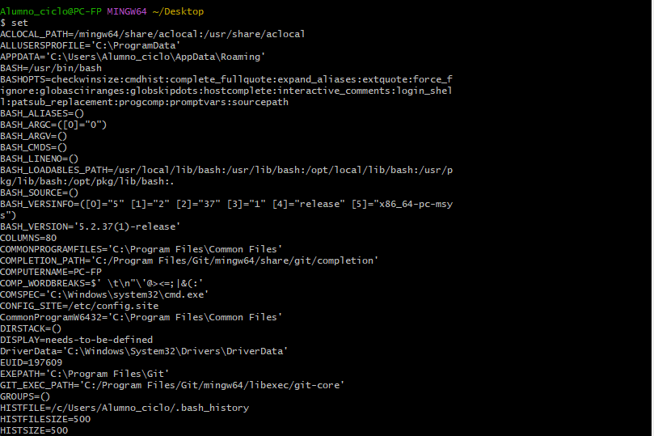<br>
      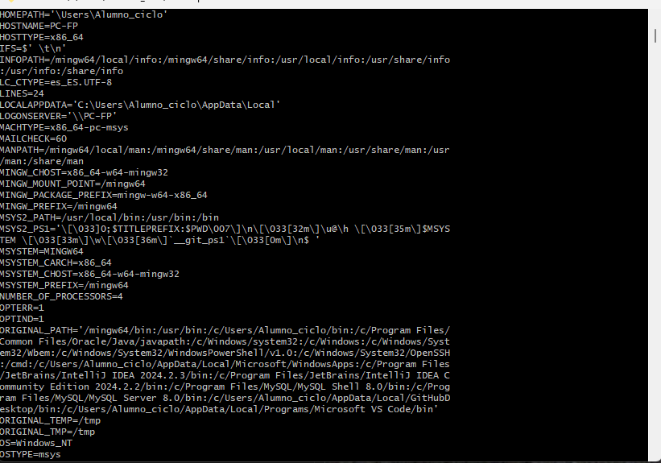

   - Muestra el contenido de la variable `PATH` (`echo %PATH%`) y de la variable `JAVA_HOME` (`echo %JAVA_HOME%`)
      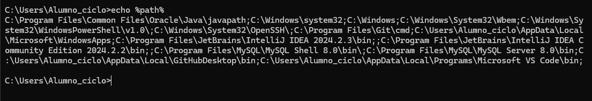

3. Instala el JDK 19 la implementaci贸n de Adoptium (Windows)

   - Ves a la p谩gina de [Adoptium](https://adoptium.net/) y descarga la versi贸n de Java 19 para Windows y la arquitectura de tu PC (x32/x64).
      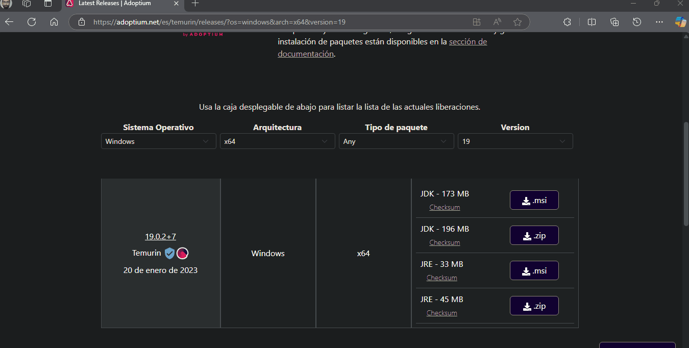
      
      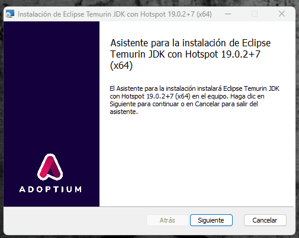

   - Una vez instalado, muestra la versi贸n de Java instalada y la ruta de instalaci贸n. (a trav茅s de comandos y adjunta una imagen) (`java -version` y `where java`)

      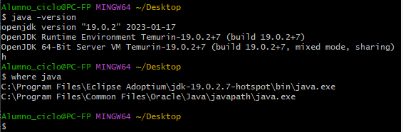

   - 驴 La versi贸n de Java que te muestra es la 19? 驴 Por qu茅?
   
         S铆, por qu茅 el asistente de instalaci贸n coloca la ruta en primer lugar dentro del "path" durante la instalaci贸n. Lo podemos ver directamente al observar que es la 1陋 que devuelve el "where java", o podemos ir a la interfaz gr谩fica y observar el orden de la lista de valores de la variable (en editar variable).
      

4. Configura tu sistema para que utilice la versi贸n de Java 19 como versi贸n por defecto a nivel de usuario. (Si ya lo tienes explica por qu茅)

   - 驴 C贸mo has configurado tu sistema para que utilice la versi贸n de Java 19 como versi贸n por defecto?
   
         Ya esta por defecto al posicionarse la primera en la lista del "path", si no, bastaria con colocarla por encima de la ruta que ya existia.
         Lo he conseguido al leer todas las opciones del cuadro de instalaci贸n y observar que me preguntaba si directamente queria que el instalador la establecerla por defecto, se帽alando "S铆".

      

### 2. Utilizaci贸n de SDKMan

5. Instala SDKMan en Windows. (_Para ello puedes seguir la gu铆a disponible [aqu铆](https://github.com/jssdocente/2425_EEDD_recursos/blob/main/UT3/docs/doc_sdkman.md)_)

   - Instala SDKMan en Windows e explica los pasos que has seguido, adjunta una captura final de SDK funcionando.

      Atendiendo al [contenido de apoyo para el SDK MAN](https://github.com/jssdocente/2425_EEDD_recursos/blob/main/UT3/docs/doc_sdkman.md);
       he buscado e instalado las librerias del protocolo Zip para mi terminal GitBash.

   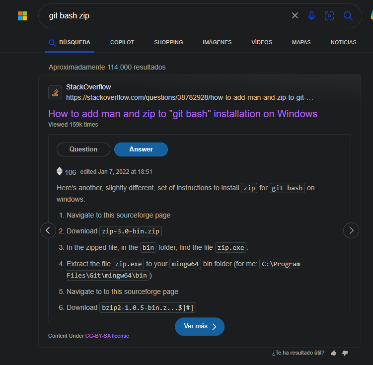

   Una vez habilitado el uso de Zip's en las terminales Bash, basta con utilizar el comando:

         curl -s "https://get.sdkman.io" | bash

      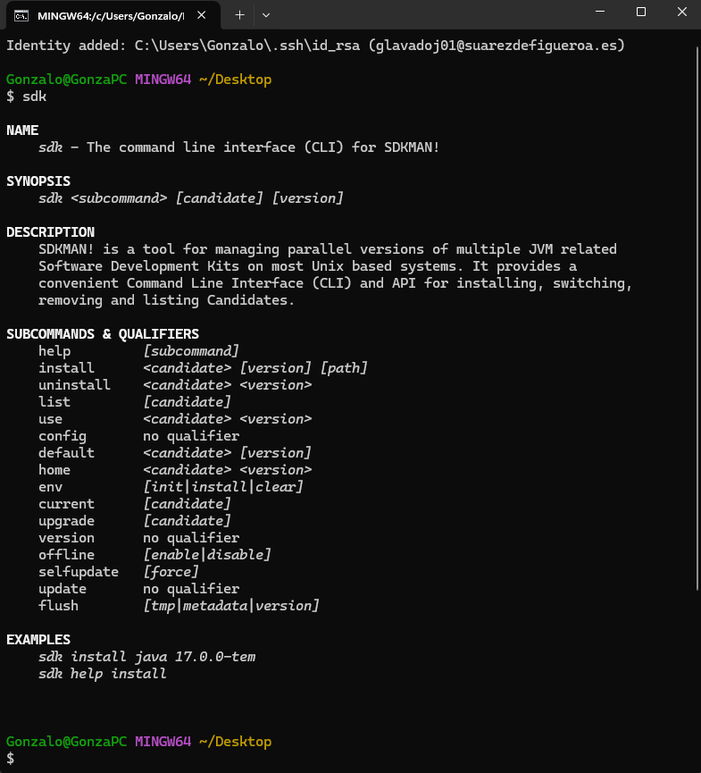

   - Muestra la versi贸n de SDKMan instalada

      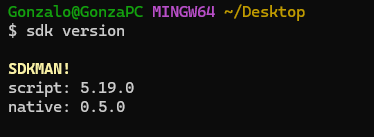

   - 驴 D贸nde se ha instalado SDKMan? 驴 Por qu茅?

         En el directorio raiz del usuario activo. Porqu茅 se instala solo en esta sesi贸n y para este usuario. Y porqu茅 es la ruta que ofrece el instalador por defecto y me parece un buen lugar.
      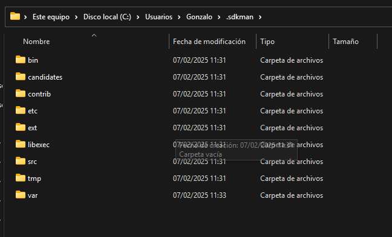

   - Muestra las versiones de Java que tienes instaladas a trav茅s de SDKMan
      
         Actualmente ninguna. Como ya se mencion贸 en el apartado 1, solo tengo 2, la que se instalo por primera vez con el IDE Intell IJi, y la que he instalado manualmente ahora mismo (adoptium). Ninguna de ellas mediante sdk man y por tanto, no estan en las carpetas "current" ni "candidate" del sdk.

         Y tras aclaraciones del profesor: hasta que configuremos la integraci贸n (puntos siguientes de este trabajo); tienen rutas y procedimientos independientes (IDE y terminales Bash)
      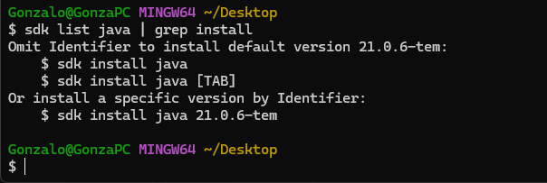

   - 驴 Qu茅 ventajas tiene instalar SDKMan?
      
         Tiene la gran ventaja de que se configura una sola vez y tras esto, nos permite cambiar entre versiones Java con un comando sencillo. Centralizando todo el procedimiento (busqueda, actualizaci贸n, instalaci贸n, cambio manual y autom谩tico, borrado) en entorno de consola sencillo y funcional.

   - 驴 Instala la versi贸n de Jara 8.0.302-zulu a trav茅s de SDKMan ?
      
         Varias versiones requeridas no se encuentran disponibles actualmente. Por lo que se opta por instalar la versi贸n m谩s antigua disponible para cada build.
      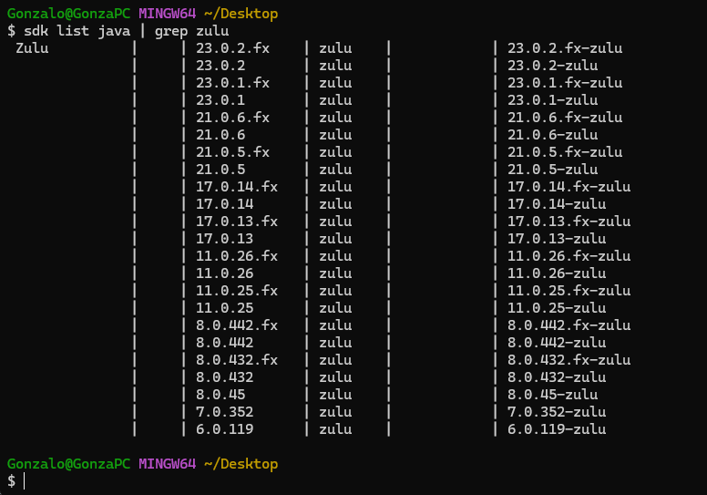<br>
         
         Se opta por la 8.0.45-zulu

   - 驴 Instala la versi贸n de Java 11.0.12-zulu a trav茅s de SDKMan ?
         
         Se opta por la 11.0.25-zulu

   - 驴 Instala la versi贸n de Java 17.0.0-zulu a trav茅s de SDKMan ?
         
         Se opta por la 17.0.13-zulu
      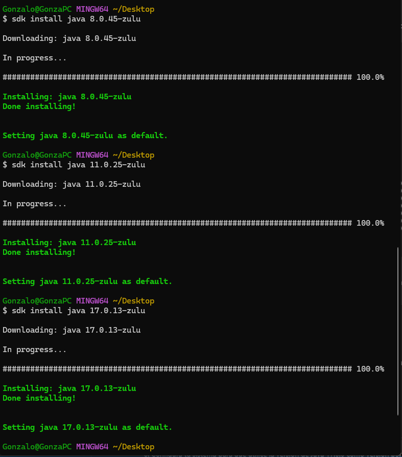

6. Configura tu sistema para que utilice la versi贸n de Java 17.0.0 como versi贸n por defecto a nivel de usuario. (Para que las aplicaciones que ejecutes utilicen esta versi贸n de Java)
      
      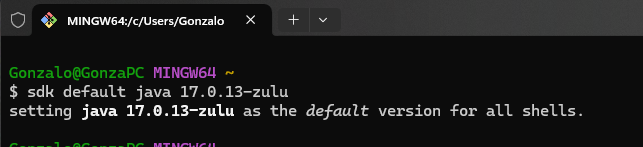
      
         Hay que usar una terminal con permisos de administrador

   - 驴 Qu茅 tienes hacer o comando tienes que utilizar (SDKMAN) para que una aplicaci贸n ejecutada desde la interfaz (Windows o Linux) utilize esa versi贸n de Java?

         sdk use java <IdVersi贸n>

   - 驴 Qu茅 variable de Entorno tienes que modificar para que una aplicaci贸n ejecutada desde la interfaz (Windows o Linux) utilize esa versi贸n de Java?
   Hay que modificar la variable "$Java_Home" para que apunkte al directorio:

         "C:\Users\Gonzalo\.sdkman\candidates\java\current"
      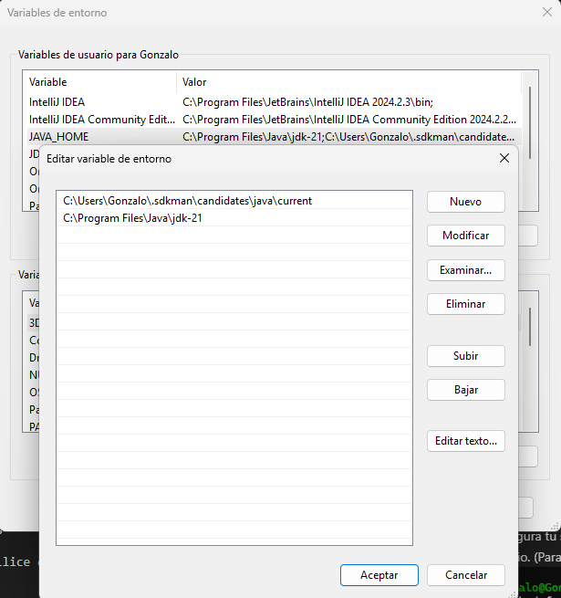

7. Si necesitas compilar una aplicaci贸n de Java desde la terminal, fuera del IDE, y necesita compilarse con la version de Java 8, 驴 C贸mo lo har铆as?

         Con SDK Man y el comando "javac"

   - 驴 Qu茅 comando de SDKMAN tienes que utilizar para que a nivel de la terminal actual use la versi贸n de Java 8?

         sdk use java 8.0.45-zulu

   - 驴 Qu茅 comando utilizas para compilar una aplicaci贸n de Java ?

         javac RutaMiPrograma\MiPrograma.java

8. Un proyecto en el que estas trabajando, neceseita la versi贸n de Java 11, pero requieres compilarlo con esa versi贸n, pero no quieres tener siempre que recordar esto, y quieres que se active autom谩ticamente esa versi贸n una vez accedas al directorio del proyecto.

   - 驴 C贸mo puedes realizar esto con SDKMAN ? (indica los comandos que tienes que utilizar y la configuraci贸n de la herramienta)

         1潞 - Activamos la versi贸n de Java que buscamos: 
         
         sdk use java 11.0.25-zulu
   
         2潞 - Hay que marcar el directorio del proyecto objetivo como "Monitoreado por SDK Man"
         Para ello, utilizamos el comando "sdk env init" en el directorio en cuesti贸n.
      
      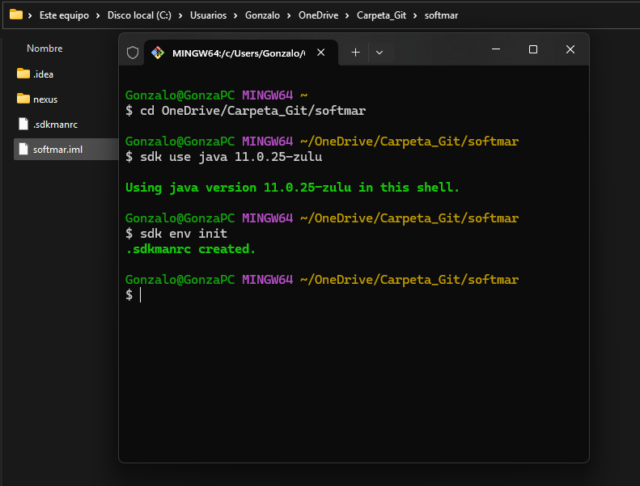

         3潞 - Hay que activar la funcionalidad para el autocambio de la version de java mediante sdk env

      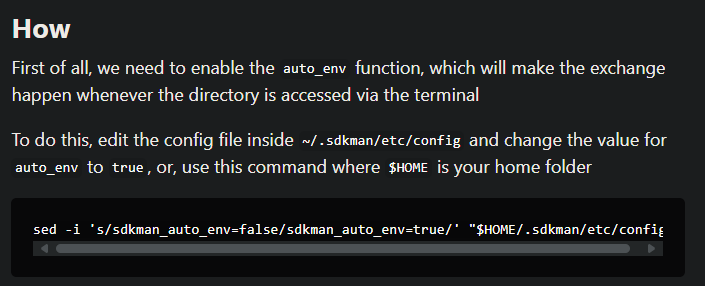<br><br>
      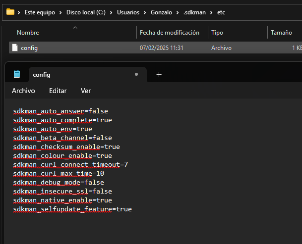
      

   - Haz una captura de pantalla entrando y saliendo del directorio del proyecto, para ver cono se activa y desactiva una versi贸n y otra de Java.

      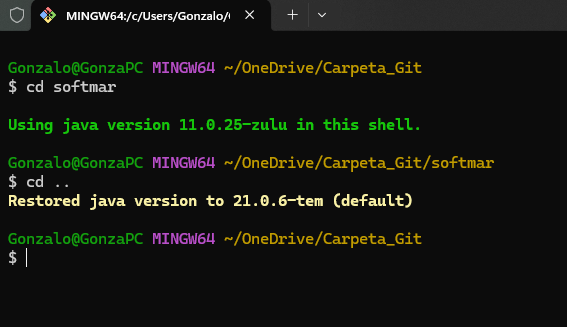

9. Ahora en Eclipse, configura el JDK 17 descargado con SDKMAN, como JDK por defecto.

   - 驴 C贸mo has configurado Eclipse para que utilice el JDK 17 descargado con SDKMAN? (Muestra una captura de pantalla)
      
         Pues lo 1潞 de todo, descargarndo e instalando Eclipse. Tras ello, acudimos de nuevo a la documentaci贸n de referencia
         para sdk man

      [Contenido de apoyo para el SDK MAN](https://github.com/jssdocente/2425_EEDD_recursos/blob/main/UT3/docs/doc_sdkman.md)

         En la documentaci贸n podemos ver que podemos selecionar la JDK por defecto desde el men煤 de preferencias, seleccionando
         pues la versi贸n 17 alojada en el directorio .sdk/candidates/java

      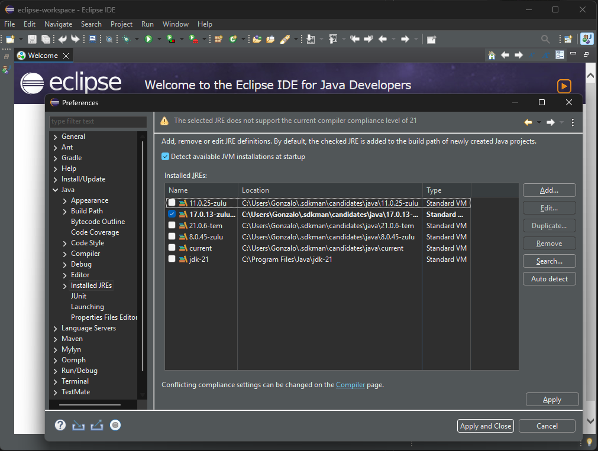


   - Inicia un nuevo proyecto (TE21-Paso9) en Eclipse y muestra la versi贸n de Java que aparece por defecto para el Workspace. (Muestra una captura de pantalla)

         Pues en este paso nos encontramos con un problema de nomenclatura: El gui贸n en el nombre del proyecto.
         Eclipse no nos permite crear un proyecto con ese nombre. Por lo que se opta por sustituirlo por una "barra baja"; quedando el nombre como: "TE21_Paso9"

      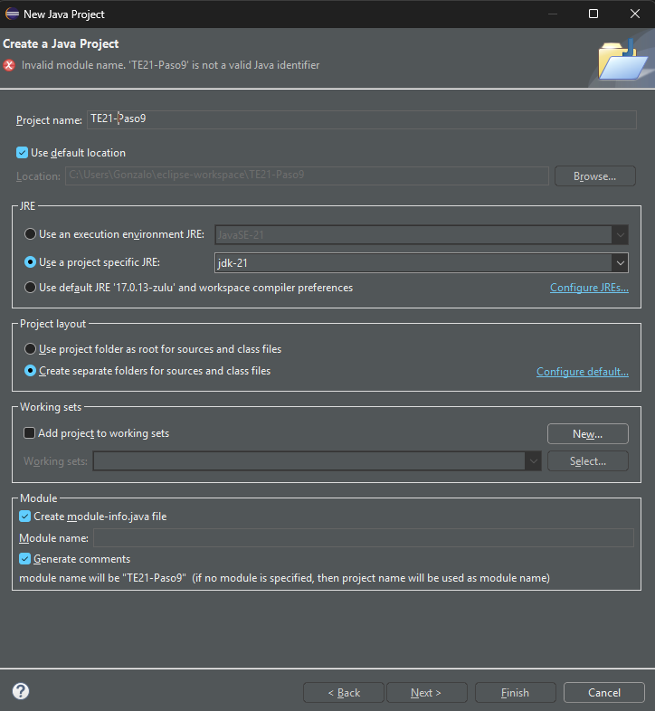

         Ademas, tambien vemos, que nos pregunta que JDK queremos utilizar, por lo que seleccionamos la opci贸n:
         "Use default JRE zulu-17"
         Que es la que acabamos de configurar en el paso previo.
         
         Curiosamente, la opci贸n intermedia que detecta con una jdk-21; hace referencia, a la JDK que se encuentra en "C:\Program Files\Java\"
         que viene a ser la que se intala por defecto con IntelliJ. A pesar de que actualmente, no se encuentra en el PATH ni en ninguna variable de entorno.
      
      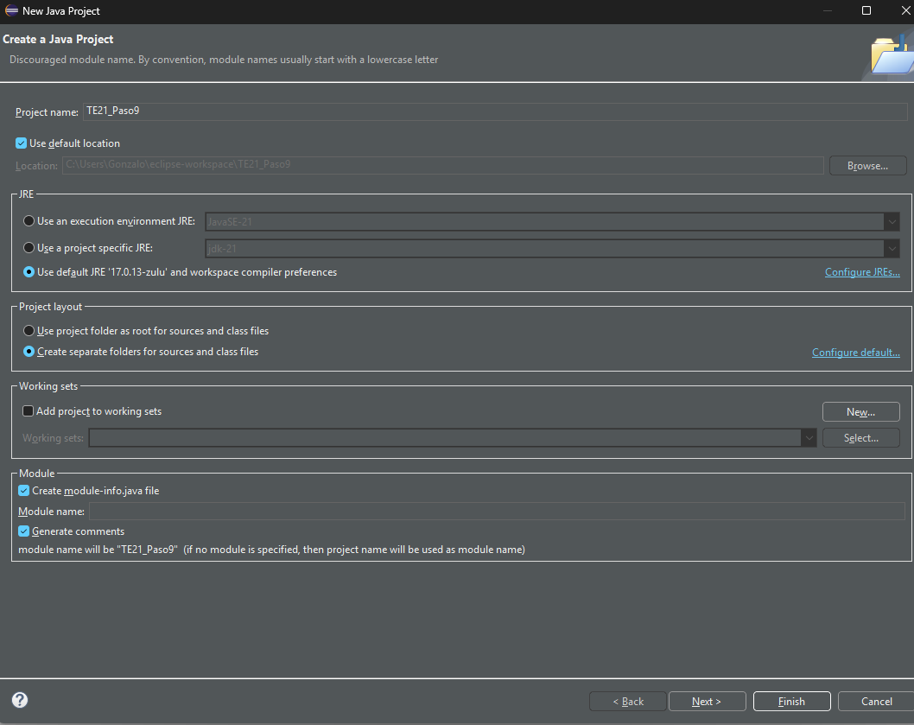

      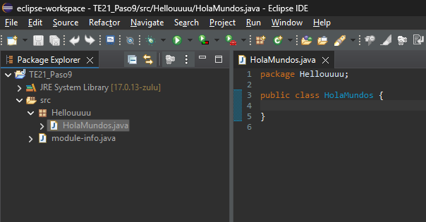

   - Cambia la versi贸n de Java del proyecto para que utilize la versi贸n de Java 8. (Muestra una captura de pantalla)

      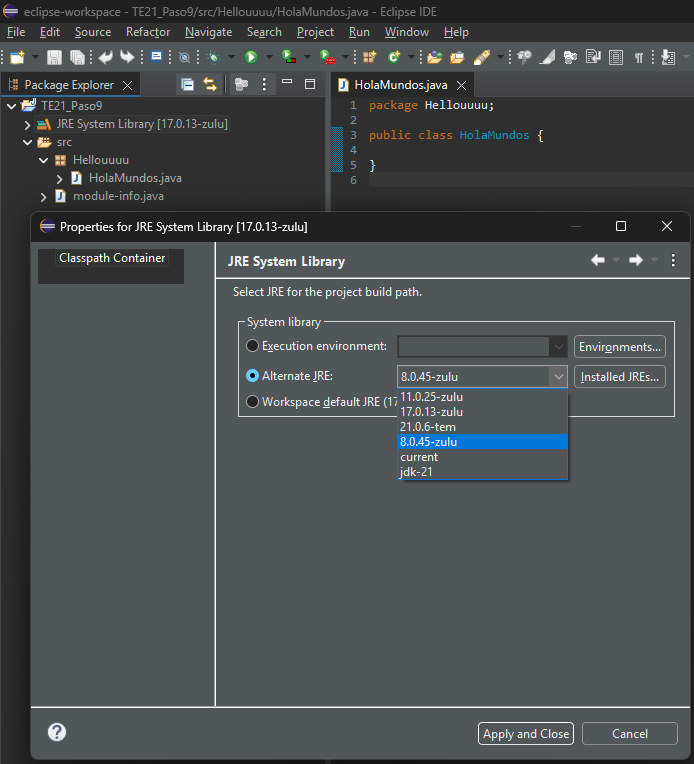

      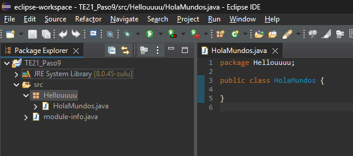

### 3. Utilizaci贸n de JetBrains IntelliJ IDEA y Eclipse

10. Crea un nuevo proyecto en IntelliJ IDEA (TE21-Paso10) y configura en ese directorio, con SDKMAN para que utilize la versi贸n de Java 11.

   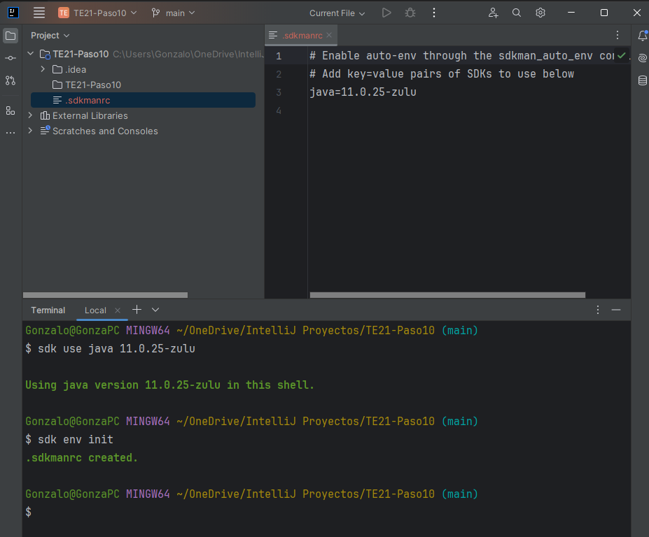

- Ahora al abrir IntellJ IDEA, debe activar esa versi贸n automaticamente, pues detectar la configuraci贸n. (Incluye una captura de panntalla o GIF de la configuraci贸n)

   

11. Importar el proyecto TE21-Paso9 en IntelliJ IDEA que has creado en Eclipse.

         Para realizar este paso, ademas de abrir el proyecto desde Intell IJ, debemos de referencias la dependencia a un modulo externo.

   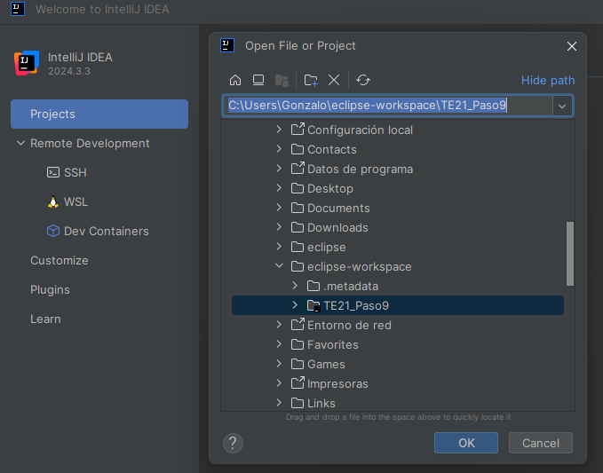

         Ademas, se puede concretar y se帽alar que proviene de Eclipse.

   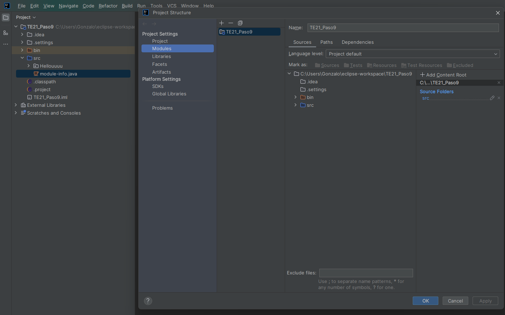

- Revisa la configuraci贸n de la versi贸n de Java que utiliza el proyecto 驴Es la misma que utiliza Eclipse?. (Muestra una captura de pantalla)

      No, no es la misma configuraci贸n. La que se ha activado es la version DEFAULT del SDKMAN. Que es la que esta selecionada como predeterminada para Intell IJ
  
  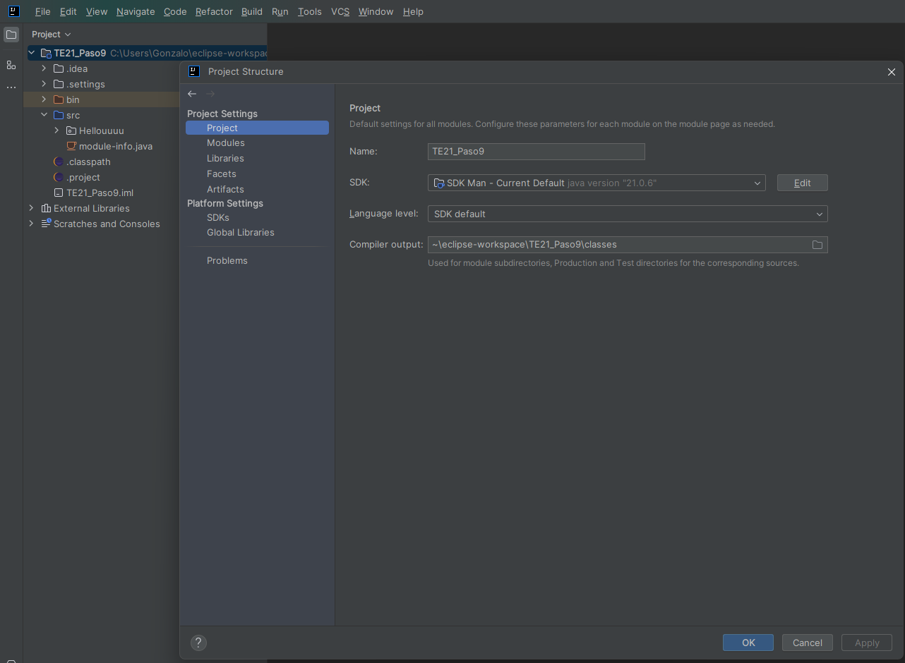
  
  Explica seg煤n tu opini贸n y en base a la configuraci贸n aplicada al proyecto de Eclipse realizada en el paso 9, si debe ser la misma versi贸n de JDK en ambos proyectos o si esto depende de otras configuraciones extenas al proyecto.

      En mi opini贸n, el proceso es correcto. Ya que a cada IDE le hemos dado unas configuraciones por defecto. Salvo que se encuentren un archivo .sdkmanrc que les indique lo contrario. Y en concreto, para el proyecto eclipse, no creamos dicho archivo de configuraci贸n.

   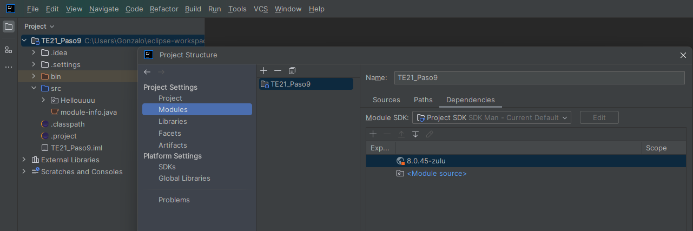

      Ademas, podemos observar en las dependencias del Modulo importado de Eclipse, se indica que este a su vez depende de la SDK 8-zulu.

12. Crea un nuevo proyecto en IntelliJ IDEA (TE21-Paso12) que se guarde en la carpeta TE21-Paso12.

- Configura el proyecto para que utilice la versi贸n de Java 17 descargada con SDKMAN. (Muestra una captura de pantalla de la configuraci贸n del fichero .sdkmanrc)
   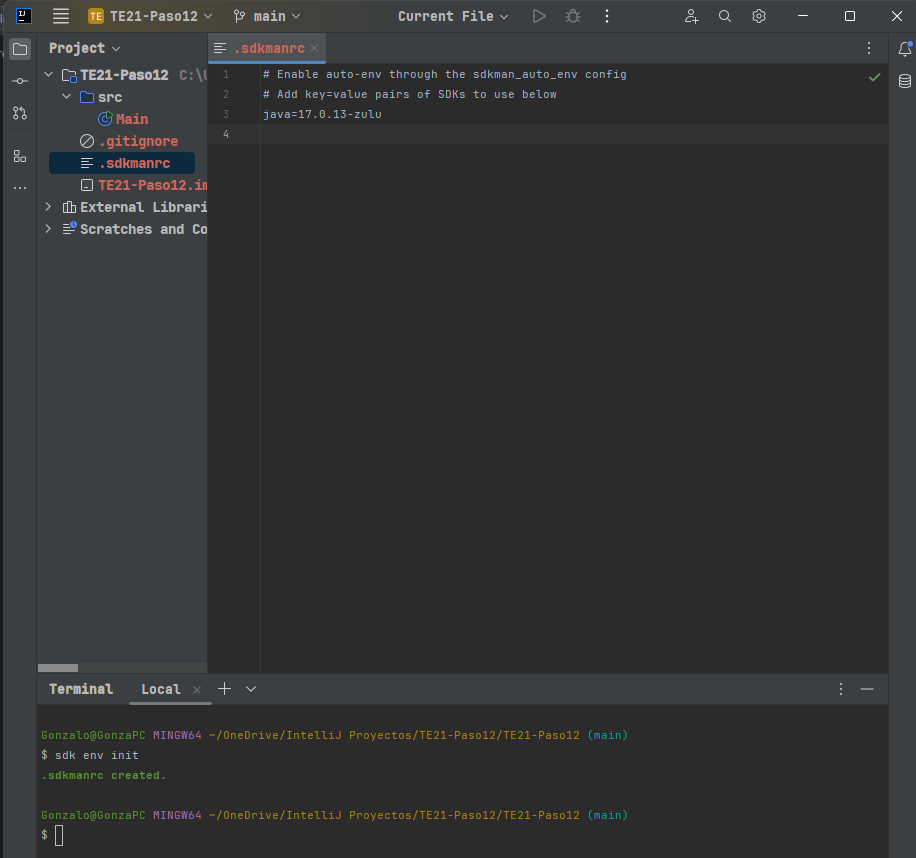
- Agrega otro m贸dulo al proyecto, que se guarde en la carpeta Modulo2.
- Agrega otro m贸dulo al proyecto, que se guarde en la carpeta Modulo3.

(Muestra una captura de pantalla de la estructura del proyecto en IntelliJ IDEA)
   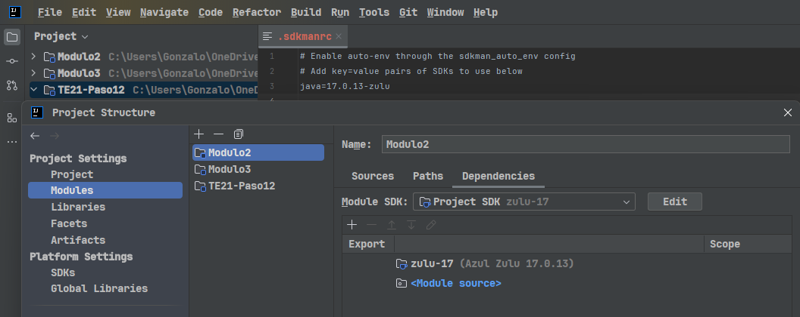
- Vincula el proyecto principal, con los m贸dulos 2 y 3. (Muestra una captura de pantalla de la configuraci贸n de los m贸dulos)
   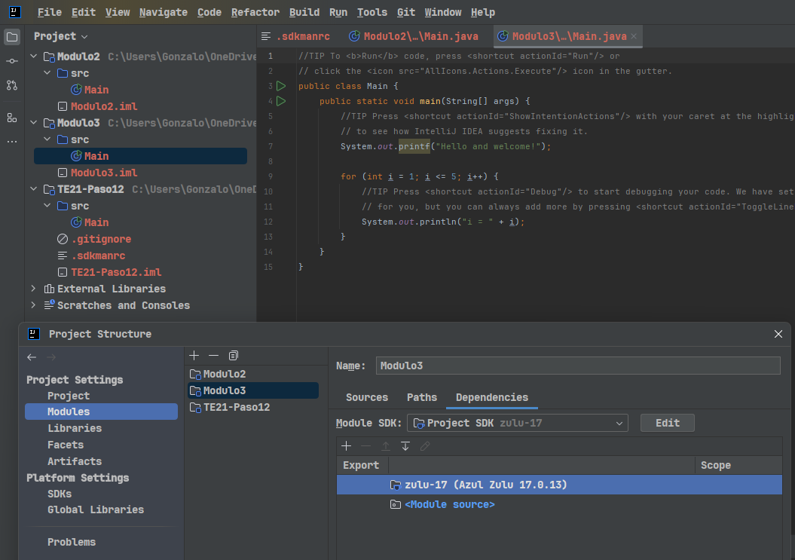

13. En el m贸dulo 2, crea una clase que se llame `Utilidades` y que tenga un m茅todo que se llame `calculadora` y que tenga los m茅todos de suma, resta, multiplicaci贸n y divisi贸n.

(Muestra el c贸digo de la clase `Utilidades` con un bloque de c贸digo)
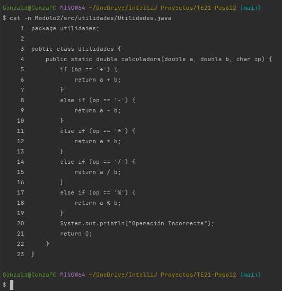

14. En el m贸dulo 3, crea una clase llamada `Conversor` que tenga un m茅todo que se llame `Texto_to_Uppercase` que convierta un texto a may煤sculas, y otro m茅todo que se llame `Texto_to_Lowercase` que convierta un texto a min煤sculas.

(Muestra el c贸digo de la clase `Conversor` con un bloque de c贸digo)
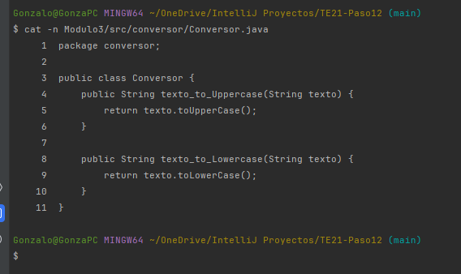

15. En el m贸dulo principal, crea una clase llamada `Principal` que tenga un m茅todo `main` que instancie las clases `Utilidades` y `Conversor` y que muestre por consola el resultado de las operaciones de la clase `Utilidades` y el resultado de las operaciones de la clase `Conversor`.

(Muestra un gif donde se muestre la ejecuci贸n del programa, en depuraci贸n y se visualice que no existen errores de compilaci贸n ni ejecuci贸n).
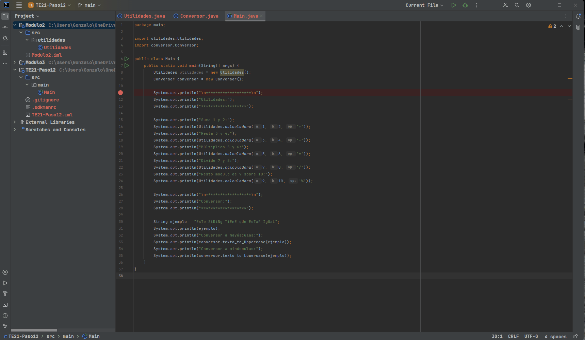