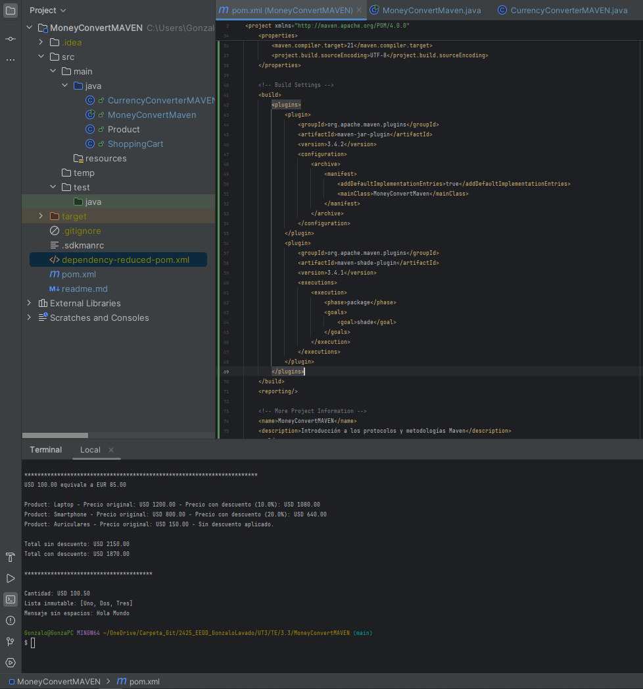

# Práctica Guiada: Introducción a Maven

## ¿Qué es Maven?
Maven es una herramienta de gestión y automatización de proyectos de software, principalmente utilizada en proyectos Java. Facilita la administración de dependencias, la compilación, las pruebas y la distribución del software.

### ¿Por qué es importante Maven?
- Permite una gestión eficiente de dependencias.
- Estandariza la estructura de proyectos.
- Automatiza procesos como la compilación, pruebas y empaquetado.
- Facilita la integración con herramientas de CI/CD.

### Funcionamiento de Maven
1. **Definición del proyecto**: Se describe en un archivo `pom.xml`.
2. **Resolución de dependencias**: Descarga automáticamente bibliotecas necesarias.
3. **Compilación**: Traduce el código fuente a bytecode.
4. **Pruebas**: Ejecuta pruebas unitarias y de integración.
5. **Empaquetado**: Genera artefactos (JAR, WAR, etc.).
6. **Instalación y despliegue**: Publica los artefactos en un repositorio.

---
## ¿Qué es XML?
XML (eXtensible Markup Language) es un lenguaje de marcas utilizado para estructurar datos. En Maven, XML se usa en `pom.xml` para definir la configuración del proyecto.

## Archivo `pom.xml`
Este archivo es el corazón de Maven. Contiene:
- **project**: Nodo principal.
- **modelVersion**: Versión del modelo de `pom.xml`.
- **groupId**: Identificador del proyecto.
- **artifactId**: Nombre del artefacto generado.
- **version**: Versión del proyecto.
- **dependencies**: Lista de librerías necesarias.

Ejemplo de `pom.xml`:

```xml
<project xmlns="http://maven.apache.org/POM/4.0.0"
         xmlns:xsi="http://www.w3.org/2001/XMLSchema-instance"
         xsi:schemaLocation="http://maven.apache.org/POM/4.0.0 http://maven.apache.org/xsd/maven-4.0.0.xsd">
    <modelVersion>4.0.0</modelVersion>
    <groupId>com.example</groupId>
    <artifactId>maven-demo</artifactId>
    <version>1.0-SNAPSHOT</version>
    <dependencies>
        <!-- Dependencias irían aquí -->
    </dependencies>
</project>
```

---
## Instalación de Maven con SDKMan

1. **Instalar SDKMan**:
   ```sh
   curl -s "https://get.sdkman.io" | bash
   ```
   Luego, reiniciar la terminal y ejecutar:
   ```sh
   source "$HOME/.sdkman/bin/sdkman-init.sh"
   ```
2. **Instalar Maven**:
   ```sh
   sdk install maven
   ```
3. **Verificar la instalación**:
   ```sh
   mvn -version
   ```

---
## Crear un Proyecto Maven en IntelliJ IDEA

1. Abrir IntelliJ IDEA y seleccionar **New Project**.
2. Elegir **Maven** como tipo de proyecto.
3. Configurar `groupId`, `artifactId` y `version`.
4. Finalizar y abrir el proyecto.

### Agregar la librería Joda Money

Editar `pom.xml` y añadir:
```xml
<dependencies>
    <dependency>
        <groupId>org.joda</groupId>
        <artifactId>joda-money</artifactId>
        <version>1.0.1</version>
    </dependency>
    <dependency>
        <groupId>com.google.guava</groupId>
        <artifactId>guava</artifactId>
        <version>31.0.1-jre</version>
    </dependency>
    <dependency>
        <groupId>org.apache.commons</groupId>
        <artifactId>commons-lang3</artifactId>
        <version>3.12.0</version>
    </dependency>
</dependencies>
```

### Crear una Clase de Ejemplo

Crear `MoneyConvertMaven.java` dentro de `src/main/java/com/example`:

```java
import org.joda.money.CurrencyUnit;
import org.joda.money.Money;
import com.google.common.collect.ImmutableList;
import org.apache.commons.lang3.StringUtils;

public class MoneyConvertMaven {
    public static void main(String[] args) {
        Money amount = Money.of(CurrencyUnit.USD, 100.50);
        System.out.println("Cantidad: " + amount);
        
        // Uso de Guava
        ImmutableList<String> list = ImmutableList.of("Uno", "Dos", "Tres");
        System.out.println("Lista inmutable: " + list);
        
        // Uso de Apache Commons Lang
        String mensaje = "  Hola Mundo  ";
        System.out.println("Mensaje sin espacios: " + StringUtils.trim(mensaje));
    }
}
```

### Compilar y Ejecutar el Proyecto

1. Abrir una terminal en IntelliJ y ejecutar:
   ```sh
   mvn clean package
   ```
2. Generar el archivo `.jar` ejecutando:
   ```sh
   mvn package
   ```
   Esto creará un archivo JAR en `target/maven-demo-1.0-SNAPSHOT.jar`.
3. Ejecutar el JAR generado:
   ```sh
   java -jar target/maven-demo-1.0-SNAPSHOT.jar
   ```



---
## Repositorios en Maven y Ubicación de Librerías en Windows

### ¿Dónde se guardan las librerías descargadas con Maven en Windows?
Cuando Maven descarga dependencias, las almacena en el **repositorio local**, que en Windows se encuentra en:
```
C:\Users\TU_USUARIO\.m2\repository
```
Aquí se almacenan todas las librerías en carpetas organizadas por `groupId` y `artifactId`.

### ¿Qué es un repositorio en Maven?
Un repositorio en Maven es un almacenamiento de artefactos (librerías, plugins, etc.). Hay tres tipos principales:

1. **Repositorio Local**: Se encuentra en la máquina del usuario (`.m2/repository`). Maven almacena aquí todas las dependencias descargadas.
2. **Repositorio Central**: Es el repositorio oficial de Maven, ubicado en `https://repo.maven.apache.org/maven2/`. Si una dependencia no está en el repositorio local, Maven la descarga de aquí.
3. **Repositorios Remotos**: Son repositorios personalizados alojados en servidores privados o en plataformas como Nexus o JFrog Artifactory. Se configuran en `pom.xml`.

Ejemplo de configuración de un repositorio remoto en `pom.xml`:

```xml
<repositories>
    <repository>
        <id>mi-repositorio</id>
        <url>https://mirepositorio.com/repo</url>
    </repository>
</repositories>
```

Con esto, hemos aprendido dónde se guardan las librerías en Windows y el concepto de repositorios en Maven.
