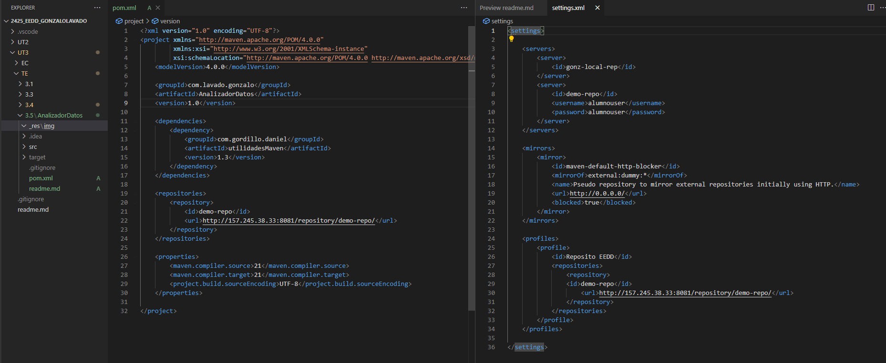
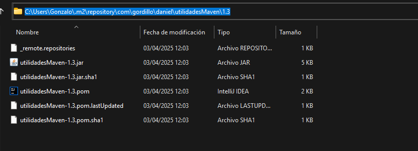
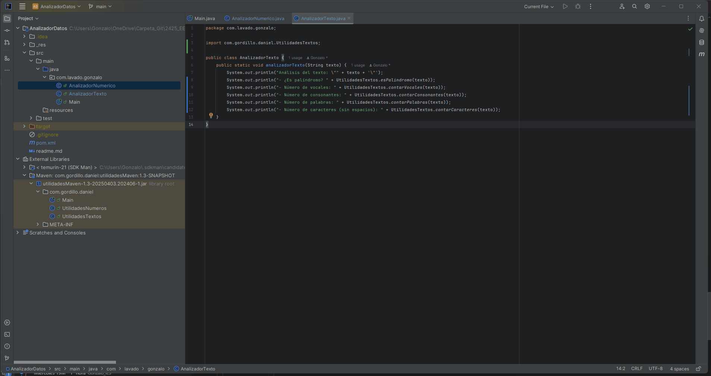

# Ejercicio 3.5 - Usar librería Maven desplegada en repositorio de clase

El objetivo de este ejercicio es usar la librería Maven desplegada en el servidor Maven hosted, creada por un compañero.

## Alumnos que realizan la actividad:

- Alumno 1: Gonzalo Lavado Jaén
- Alumno 2: Daniel Gordillo Gutierrez


### Recursos

- [Explicación de los archivos pom y settings](https://josemtech.com/2022/12/01/archivos-pom-y-settings/)

## Entrega

Guarda este proyecto en tu repositorio de Github, dentro de la carpeta `TE\3.5`, con el nombre `AnalizadorDatos`. Será un proyecto basado en Maven.

Copia este documento en el `README.md` del proyecto. Crea también uan carpeta llamada `_res/img` y guarda las capturas de pantalla que se solicitan en este documento. 

## Enunciado


### 1. Crear un proyecto Maven y añadir dependencia "UtilidadesMaven"

Crea un proyecto Maven con las siguientes características:

1. **`groupId`**: `com.{apellido1}.{nombre}`.
2. **`artifactId`**: `AnalizadorDatos`.
3. **`version`**: `1.0-SNAPSHOT`.
  
Para este ejercicio, necesitas vincular la librería creada por el compañero en tu proyecto. 

-  Agrega la dependencia de la librería en el archivo `pom.xml` de tu proyecto.

Ahora intenta compilar el proyecto, utilizando el comando `mvn compile`.

- Como la librería no está disponible en el repositorio local, Maven no puede descargarla y se produce un error.<br>

**¿Por qué no puede descargarla?**
Porque la librería no está en el repositorio local, y Maven no conoce la dirección del repositorio hosted, ya que no está indicada en el archivo `pom.xml`. Esta información la puedes indicar en el archivo `pom.xml` o en el archivo `settings.xml` de Maven.

Dentro del archivo `pom.xml`, indica la dirección del repositorio hosted.

```xml
<repositories>
    <repository>
        <id>demo-repo</id>
        <url>http://10.0.10.253:8081/repository/demo-repo/</url>
    </repository>
</repositories>
```

**¿Qué debes hacer para solucionar este problema?**
Debes indicar a Maven la dirección del repositorio hosted, dentro del fichero `pom.xml` para que pueda descargar la librería.

**¿Dónde se indica la dirección del repositorio de clase?**

En el archivo `pom.xml` y en el archivo `settings.xml` de Maven.

En el archivo `pom.xml` tiene un alcance de solo el proyecto actual, y si lo realizamos dentro del `settings.xml` tiene un alcance global a todo el sistema.

> En el `pom.xml`

```xml
<repositories>
    <repository>
        <id>demo-repo</id>
        <url>http://10.0.10.253:8081/repository/demo-repo/</url>
    </repository>
</repositories>
```

> En el fichero `settings.xml`

Para definirlo dentro dentro de este fichero, es necesario incluirlo dentro del nodo `profiles`, ya que se pueden tener diferentes configuraciones.

En el ejemplo siguiente, se incluye el nombre del perfil simulnado a una empresa, que es la clase de EEDD de este ciclo.

```xml
<settings xmlns="http://maven.apache.org/SETTINGS/1.0.0" xmlns:xsi="http://www.w3.org/2001/XMLSchema-instance"
  xsi:schemaLocation="http://maven.apache.org/SETTINGS/1.0.0 https://maven.apache.org/xsd/settings-1.0.0.xsd">
  <localRepository/>
  <interactiveMode/>
  <offline/>
  <pluginGroups/>
  <servers>
   <server>
        <id>demo-repo</id>
        <username>alumnouser</username>
        <password>alumnouser</password>
    </server>
  </servers>	
  <mirrors/>
  <proxies/>
  <!-- agregar esto -->
  <profiles>
   <profile>
     <id>empresa-eedd-daw</id>
     <repositories>
       <repository>
        <id>demo-repo</id>
	      <url>http://192.168.65.102:8081/repository/demo-repo</url>
       </repository>
     </repositories>
   </profile>
  </profiles>
  <!-- hasta aquí -->
  <activeProfiles/>
</settings>
```

> EN NUESTRO APLICACIÓN VAMOS A AGREGARLO DENTRO DEL FICHERO `pom.xml`.

**Sigue sin funcionar, ahora otro error**

Ahora el problema está relacionado con que desde la versión +3.8.1 de Maven, no permite acceder a través del protocolo HTTP, es necesario hacerlo a través del HTTPS.
El problema es que nuestro servidor creado no tiene un certificado, y por tanto no podemos acceder a través de HTTPS.

*Solución*
Desactivar esta comprobación, haciendo el sistema más inseguro.

Agregar una nueva configuración al fichero `.m2\settings.xml`.

```xml
<mirrors>
 <mirror>
    <id>maven-default-http-blocker</id>
    <mirrorOf>external:dummy:*</mirrorOf>
    <name>Pseudo repository to mirror external repositories initially using HTTP.</name>
    <url>http://0.0.0.0/</url>
    <blocked>true</blocked>
 </mirror>
</mirrors>
```

**Volver a probar a compilar**

Ahora sí, nos debería haber compilado el proyecto, y por tanto haber descargado la dependencia.

> Adjunta una imagen dentro de la carpeta `.m2\repository`, donde se muestre que la librería del compañero está descargada.

> Configuración pom y settings


> Repositorio local con dependencia del compañero descargada



#### 2. Crear funcionalidad utilizando funciones de la librería "UtilidadesMaven"

Una vez tenemos el proyecto configurado queda realizar la funcionalidad del proyecto con las funciones proporcionadas por la librería del compañero.

**2.1 Estructura del Proyecto**
   
El proyecto deberá seguir la estructura de un proyecto Maven con el siguiente esquema:

  AnalizadorDatos/

    │── src/
    │   ├── main/
    │   │   ├── java/
    │   │   │   ├── com.{apellido1}.{nombre}.analizadordatos/
    │   │   │   │   ├── Main.java
    │   │   │   │   ├── AnalizadorNumerico.java
    │   │   │   │   ├── AnalizadorTexto.java
    │── pom.xml

**2.2 Funcionalidades del Programa**
   
El programa debe permitir al usuario interactuar mediante un menú de opciones en la consola, donde podrá analizar números y textos ingresados.

*Opción 1: Análisis Numérico*

El usuario ingresará un número entero y el programa deberá mostrar:

  - Si el número es par o impar (esPar, esImpar).
  - Si el número es primo (esPrimo).
  - Su factorial (factorial).
  - Sus divisores (devolverDivisores).
  - Si es perfecto (esPerfecto).
  
  <br>

*Opción 2: Análisis de Texto*
  
El usuario ingresará una cadena de texto y el programa deberá mostrar:

  - Si la cadena es un palíndromo (esPalindromo).
  - El número de vocales (contarVocales).
  - El número de consonantes (contarConsonantes).
  - El número de palabras (contarPalabras).
  - El número de caracteres (contarCaracteres).

  <br>

*Opción 3: Salir*
  
  - El programa se cerrará cuando el usuario lo indique.
  
  <br>

**2.3. Requisitos Técnicos**

- Uso de Maven:

  El proyecto debe configurarse con Maven e incluir la librería UtilidadesMaven en el pom.xml.

- Buena Práctica de Código:

  Se deben utilizar clases separadas (AnalizadorNumerico.java y AnalizadorTexto.java) para manejar la lógica de análisis de números y textos.

  La clase Main.java solo debe encargarse de la interacción con el usuario y la ejecución del programa.


> *Criterios de evaluación:*

✔ Correcta implementación de la lógica del programa.
✔ Uso correcto de la librería UtilidadesMaven.
✔ Estructura del código siguiendo el paradigma POO.
✔ Uso adecuado de Maven y la estructura del proyecto.
✔ Implementación de pruebas unitarias con JUnit.

> Notas Adicionales

Se recomienda utilizar Scanner para la entrada de datos del usuario.


#### 3. Ejecutar el Programa

*Ejemplo de Salida Esperada*

Ejemplo de ejecución del programa:

> Ejemplo 1: Análisis Numérico

📌 Entrada del usuario:
  
    Seleccione una opción:  
    - 1 - Análisis Numérico  
    - 2 - Análisis de Texto  
    - 3 - Salir  

    Opción: 1  
    Ingrese un número: 28

📌 Salida esperada:

  🔢 Análisis del número: 28  
  - ¿Es par? ✅ Sí  
  - ¿Es impar? ❌ No  
  - ¿Es primo? ❌ No  
  - Factorial: 3,048,883,200  
  - Divisores: [1, 2, 4, 7, 14, 28]  
  - ¿Es perfecto? ✅ Sí (La suma de sus divisores propios es 28)  

> Ejemplo 2: Análisis de Texto

📌 Entrada del usuario:

    Seleccione una opción:  

    1 - Análisis Numérico  
    2 - Análisis de Texto  
    3 - Salir  
  
    Opción: 2  
    Ingrese una cadena de texto: "Anita lava la tina"

📌 Salida esperada:

  📝 Análisis del texto: "Anita lava la tina"  
  - ¿Es palíndromo? ✅ Sí  
  - Número de vocales: 8  
  - Número de consonantes: 8  
  - Número de palabras: 4  
  - Número de caracteres (sin espacios): 16  
  Ejemplo 3: Salida del Programa

📌 Entrada del usuario:

    Seleccione una opción:  
    1 - Análisis Numérico  
    2 - Análisis de Texto  
    3 - Salir  

    Opción: 3
    
    📌 Salida esperada:
    
    👋 ¡Gracias por usar el Analizador de Datos! Hasta pronto.

> Demostración de funcionamiento
