# TE3.1 - Configuración de Eclipse y JetBrains IntelliJ IDEA

En esta tarea de aprendizaje, aprenderás a instalar el JDK y JREs en Windows y Linux, y a configurar Eclipse y JetBrains IntelliJ IDEA.

## Recursos

- [Instalación del JDK en Linux](https://docs.oracle.com/javase/8/docs/technotes/guides/install/linux_jdk.html)
- [Instalación del JDK en Windows](https://docs.oracle.com/javase/8/docs/technotes/guides/install/windows_jdk_install.html)

### Objetivos

- Conocer cómo instalar el JDK/JRE en Windows y Linux.
- Conocer cómo configurar Eclipse y JetBrains IntelliJ IDEA para utilizar un JDK.
- Conocer cómo configurar Windows y Linux a nivel de sistema para utilizar diferentes versiones de Java.
- Conocer cómo instalar y usar la herramienta SDKMan para instalar diferentes versiones de Java en Linux/MacOS/Windows.

### Recursos

**GIF Videos**

- [Software crear GIFs animados para Windows](https://www.screentogif.com/)
- [Software crear GIFs animados para Linux](https://github.com/phw/peek)
- [Herramienta Online GIF](https://ezgif.com/video-to-gif)

### Entrega

El documento justificativo de la realización de la tarea se realizará en formato `Markdown`, el nombre del fichero será `readme.md` y estará dentro de la carpeta `UT3\TE3.1` dentro del repositorio oficial del alumno para la asignatura.

El fichero `readme.md` debe contener los siguientes apartados:

- Cada uno de los puntos de la tarea.

### 1. Configuración de Java en Windows y Linux

1. Revisa la configuración de tu máquina a través del terminal e indica la versión de Java que tienes instalada.

```bash
# Comprueba la versión de Java instalada
$> java -version
# Comprueba donde está instalado Java
$> where java
# Busca todas las versiones de Java instaladas
$> which java
```
📎 _Adjunta una imagen de los comandos anteriores y responde a las siguientes preguntas_

   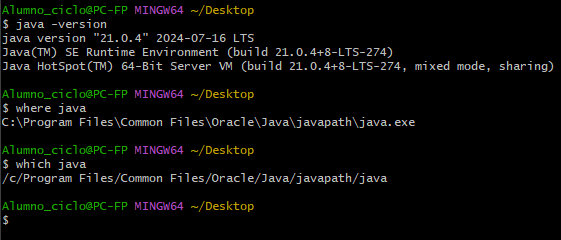

   ¿Qué versión de Java tienes instalada?

      Java 21.0.4

   ¿Cuantas versiones de Java tienes instaladas? ¿Por qué?

      Una, por que hasta ahora, nunca he necesitado más. Así que siempre me aseguraba de mantener solo la versión que utilizo.

   Si tienes más de una versión indica todas las versiones y rutas de instalación.

      Java 21.0.4 =>   C:\Program Files\Commen Files\Oracle\Java\javapath\java.exe

2. Variables de entorno.

   📎 _Adjunta una imagen de las variables de entorno de tu sistema, tanto a nivel de usuario como a nivel de sistema._
   - Muestra a través de interfaz (Ventana de windows) (Usuarios y sistema)
      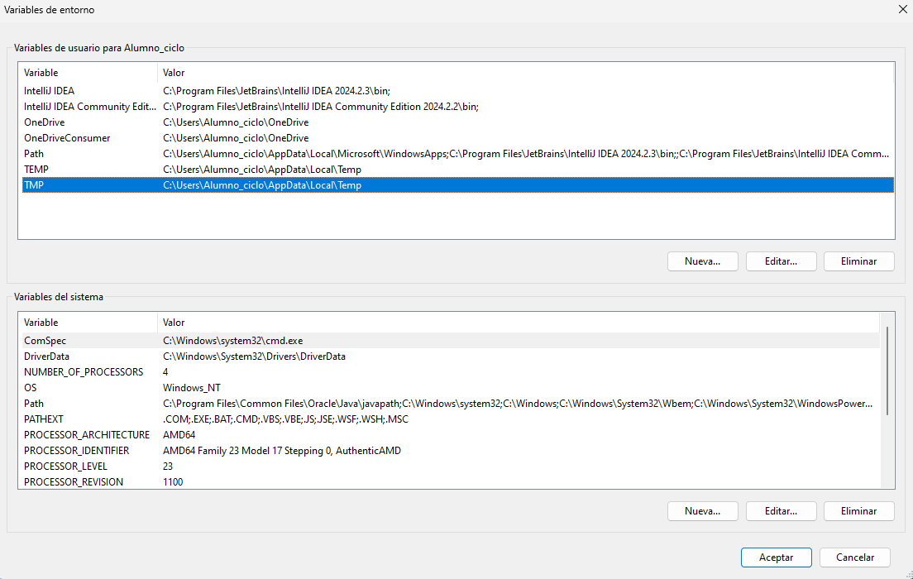

   - Muestra a nvel de comandos (Solo usuario) (`set`)
      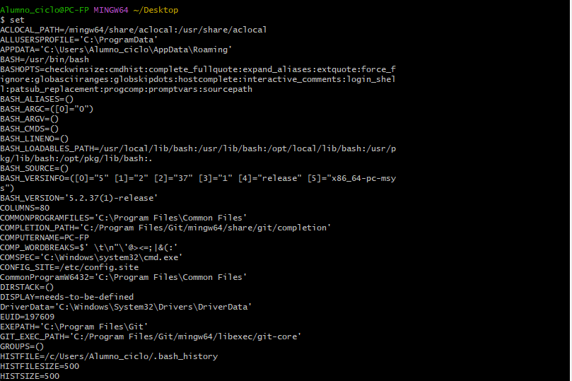<br>
      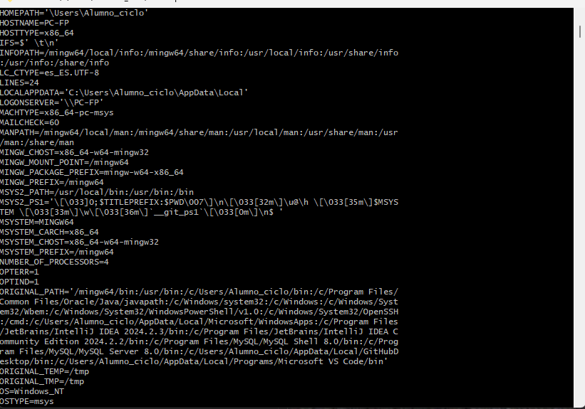

   - Muestra el contenido de la variable `PATH` (`echo %PATH%`) y de la variable `JAVA_HOME` (`echo %JAVA_HOME%`)
      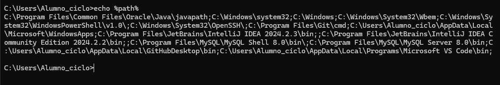

3. Instala el JDK 19 la implementación de Adoptium (Windows)

   - Ves a la página de [Adoptium](https://adoptium.net/) y descarga la versión de Java 19 para Windows y la arquitectura de tu PC (x32/x64).
      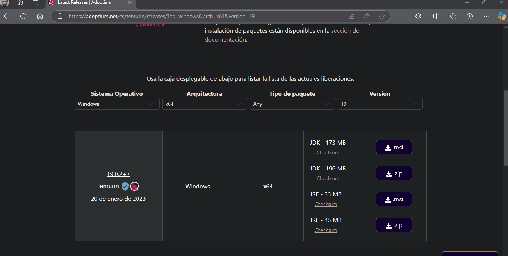
      
      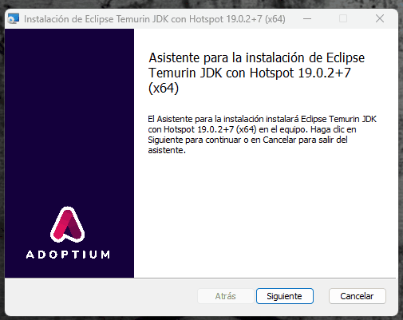

   - Una vez instalado, muestra la versión de Java instalada y la ruta de instalación. (a través de comandos y adjunta una imagen) (`java -version` y `where java`)

      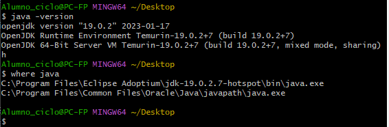

   - ¿ La versión de Java que te muestra es la 19? ¿ Por qué?
   
         Sí, por qué el asistente de instalación coloca la ruta en primer lugar dentro del "path" durante la instalación. Lo podemos ver directamente al observar que es la 1ª que devuelve el "where java", o podemos ir a la interfaz gráfica y observar el orden de la lista de valores de la variable (en editar variable).
      

4. Configura tu sistema para que utilice la versión de Java 19 como versión por defecto a nivel de usuario. (Si ya lo tienes explica por qué)

   - ¿ Cómo has configurado tu sistema para que utilice la versión de Java 19 como versión por defecto?
   
         Ya esta por defecto al posicionarse la primera en la lista del "path", si no, bastaria con colocarla por encima de la ruta que ya existia.
         Lo he conseguido al leer todas las opciones del cuadro de instalación y observar que me preguntaba si directamente queria que el instalador la establecerla por defecto, señalando "Sí".

      

### 2. Utilización de SDKMan

5. Instala SDKMan en Windows. (_Para ello puedes seguir la guía disponible [aquí](https://github.com/jssdocente/2425_EEDD_recursos/blob/main/UT3/docs/doc_sdkman.md)_)

   - Instala SDKMan en Windows e explica los pasos que has seguido, adjunta una captura final de SDK funcionando.

      Atendiendo al [contenido de apoyo para el SDK MAN](https://github.com/jssdocente/2425_EEDD_recursos/blob/main/UT3/docs/doc_sdkman.md);
       he buscado e instalado las librerias del protocolo Zip para mi terminal GitBash.

   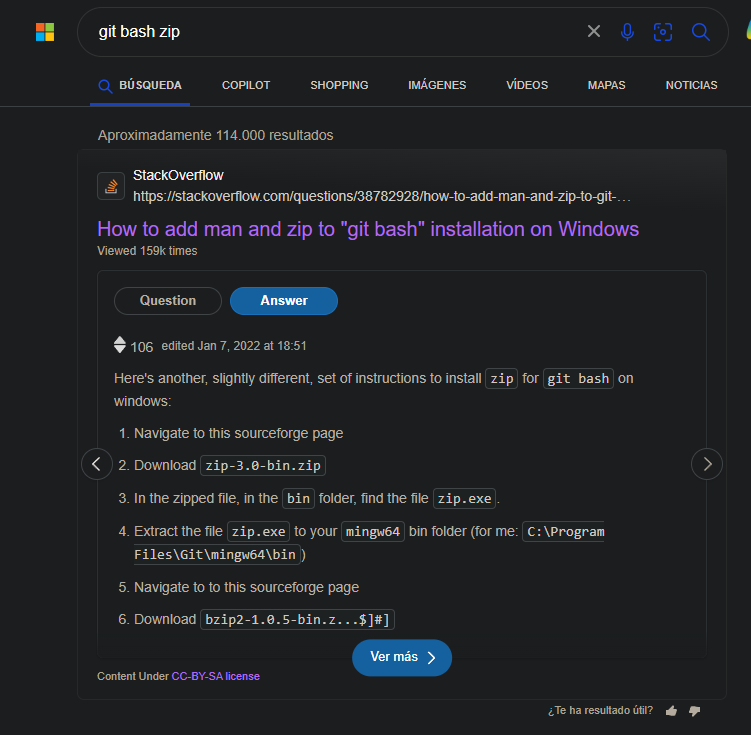

   Una vez habilitado el uso de Zip's en las terminales Bash, basta con utilizar el comando:

         curl -s "https://get.sdkman.io" | bash

      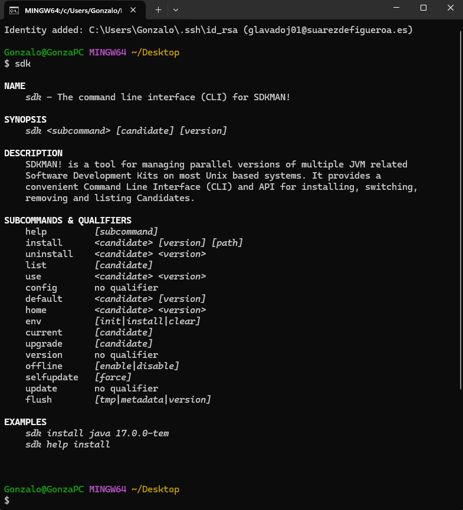

   - Muestra la versión de SDKMan instalada

      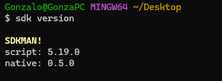

   - ¿ Dónde se ha instalado SDKMan? ¿ Por qué?

         En el directorio raiz del usuario activo. Porqué se instala solo en esta sesión y para este usuario. Y porqué es la ruta que ofrece el instalador por defecto y me parece un buen lugar.
      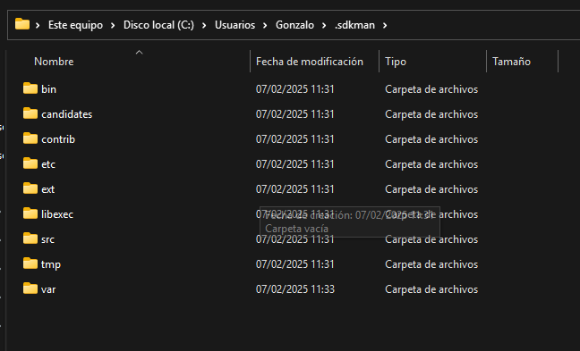

   - Muestra las versiones de Java que tienes instaladas a través de SDKMan
      
         Actualmente ninguna. Como ya se mencionó en el apartado 1, solo tengo 2, la que se instalo por primera vez con el IDE Intell IJi, y la que he instalado manualmente ahora mismo (adoptium). Ninguna de ellas mediante sdk man y por tanto, no estan en las carpetas "current" ni "candidate" del sdk.

         Y tras aclaraciones del profesor: hasta que configuremos la integración (puntos siguientes de este trabajo); tienen rutas y procedimientos independientes (IDE y terminales Bash)
      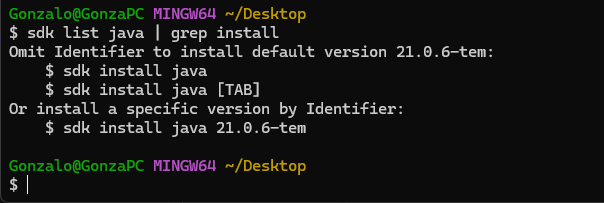

   - ¿ Qué ventajas tiene instalar SDKMan?
      
         Tiene la gran ventaja de que se configura una sola vez y tras esto, nos permite cambiar entre versiones Java con un comando sencillo. Centralizando todo el procedimiento (busqueda, actualización, instalación, cambio manual y automático, borrado) en entorno de consola sencillo y funcional.

   - ¿ Instala la versión de Jara 8.0.302-zulu a través de SDKMan ?
      
         Varias versiones requeridas no se encuentran disponibles actualmente. Por lo que se opta por instalar la versión más antigua disponible para cada build.
      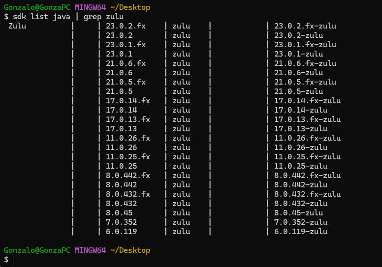<br>
         
         Se opta por la 8.0.45-zulu

   - ¿ Instala la versión de Java 11.0.12-zulu a través de SDKMan ?
         
         Se opta por la 11.0.25-zulu

   - ¿ Instala la versión de Java 17.0.0-zulu a través de SDKMan ?
         
         Se opta por la 17.0.13-zulu
      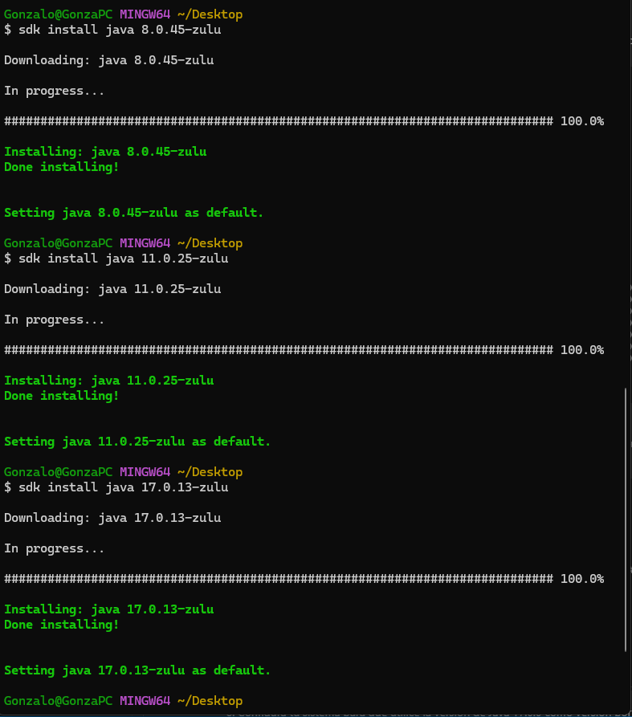

6. Configura tu sistema para que utilice la versión de Java 17.0.0 como versión por defecto a nivel de usuario. (Para que las aplicaciones que ejecutes utilicen esta versión de Java)
      
      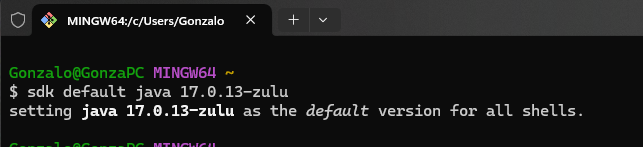
      
         Hay que usar una terminal con permisos de administrador

   - ¿ Qué tienes hacer o comando tienes que utilizar (SDKMAN) para que una aplicación ejecutada desde la interfaz (Windows o Linux) utilize esa versión de Java?

         sdk use java <IdVersión>

   - ¿ Qué variable de Entorno tienes que modificar para que una aplicación ejecutada desde la interfaz (Windows o Linux) utilize esa versión de Java?
   Hay que modificar la variable "$Java_Home" para que apunkte al directorio:

         "C:\Users\Gonzalo\.sdkman\candidates\java\current"
      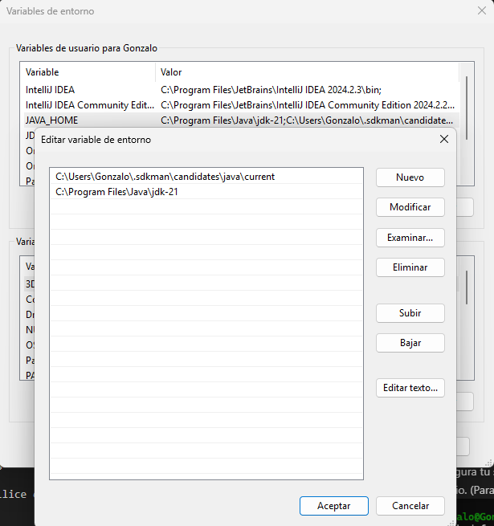

7. Si necesitas compilar una aplicación de Java desde la terminal, fuera del IDE, y necesita compilarse con la version de Java 8, ¿ Cómo lo harías?

         Con SDK Man y el comando "javac"

   - ¿ Qué comando de SDKMAN tienes que utilizar para que a nivel de la terminal actual use la versión de Java 8?

         sdk use java 8.0.45-zulu

   - ¿ Qué comando utilizas para compilar una aplicación de Java ?

         javac RutaMiPrograma\MiPrograma.java

8. Un proyecto en el que estas trabajando, neceseita la versión de Java 11, pero requieres compilarlo con esa versión, pero no quieres tener siempre que recordar esto, y quieres que se active automáticamente esa versión una vez accedas al directorio del proyecto.

   - ¿ Cómo puedes realizar esto con SDKMAN ? (indica los comandos que tienes que utilizar y la configuración de la herramienta)

         1º - Activamos la versión de Java que buscamos: 
         
         sdk use java 11.0.25-zulu
   
         2º - Hay que marcar el directorio del proyecto objetivo como "Monitoreado por SDK Man"
         Para ello, utilizamos el comando "sdk env init" en el directorio en cuestión.
      
      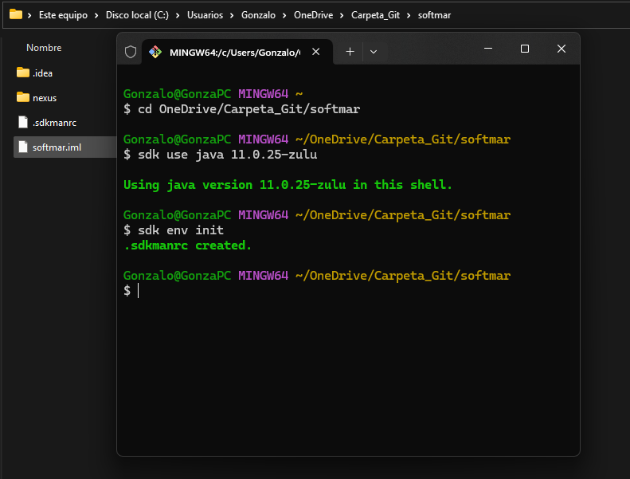

         3º - Hay que activar la funcionalidad para el autocambio de la version de java mediante sdk env

      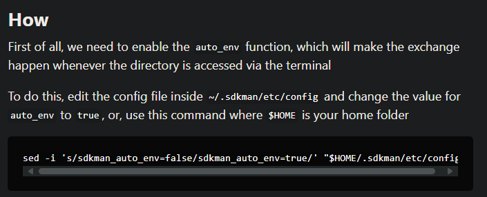<br><br>
      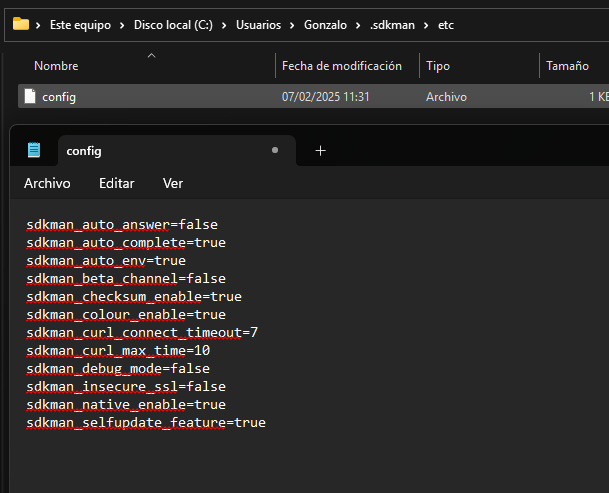
      

   - Haz una captura de pantalla entrando y saliendo del directorio del proyecto, para ver cono se activa y desactiva una versión y otra de Java.

      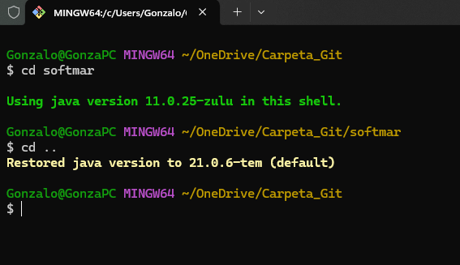

9. Ahora en Eclipse, configura el JDK 17 descargado con SDKMAN, como JDK por defecto.

   - ¿ Cómo has configurado Eclipse para que utilice el JDK 17 descargado con SDKMAN? (Muestra una captura de pantalla)
      
         Pues lo 1º de todo, descargarndo e instalando Eclipse. Tras ello, acudimos de nuevo a la documentación de referencia
         para sdk man

      [Contenido de apoyo para el SDK MAN](https://github.com/jssdocente/2425_EEDD_recursos/blob/main/UT3/docs/doc_sdkman.md)

         En la documentación podemos ver que podemos selecionar la JDK por defecto desde el menú de preferencias, seleccionando
         pues la versión 17 alojada en el directorio .sdk/candidates/java

      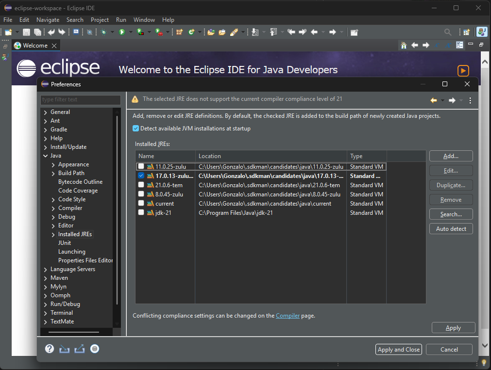


   - Inicia un nuevo proyecto (TE21-Paso9) en Eclipse y muestra la versión de Java que aparece por defecto para el Workspace. (Muestra una captura de pantalla)

         Pues en este paso nos encontramos con un problema de nomenclatura: El guión en el nombre del proyecto.
         Eclipse no nos permite crear un proyecto con ese nombre. Por lo que se opta por sustituirlo por una "barra baja"; quedando el nombre como: "TE21_Paso9"

      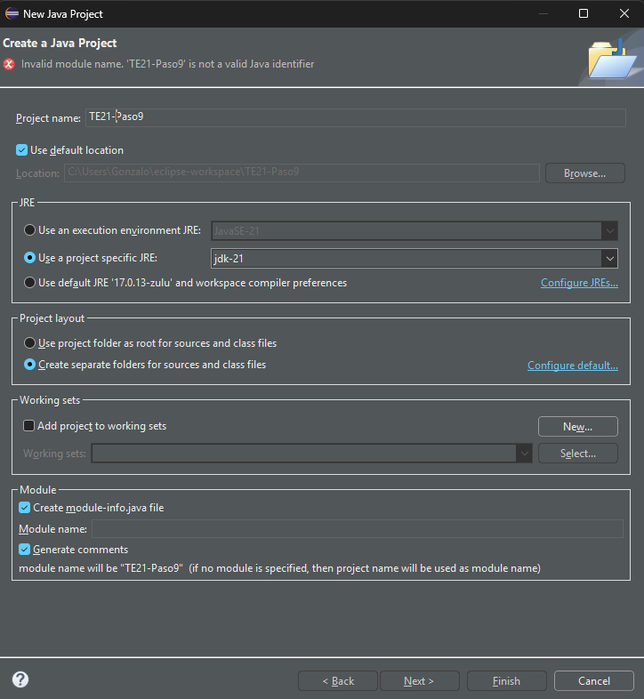

         Ademas, tambien vemos, que nos pregunta que JDK queremos utilizar, por lo que seleccionamos la opción:
         "Use default JRE zulu-17"
         Que es la que acabamos de configurar en el paso previo.
         
         Curiosamente, la opción intermedia que detecta con una jdk-21; hace referencia, a la JDK que se encuentra en "C:\Program Files\Java\"
         que viene a ser la que se intala por defecto con IntelliJ. A pesar de que actualmente, no se encuentra en el PATH ni en ninguna variable de entorno.
      
      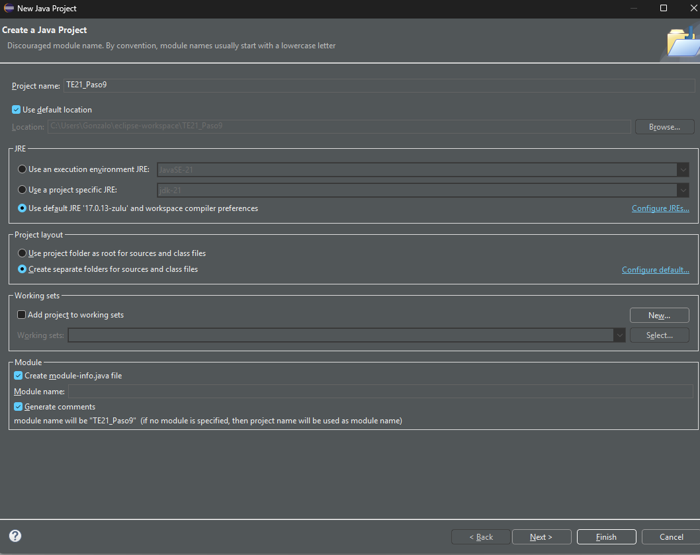

      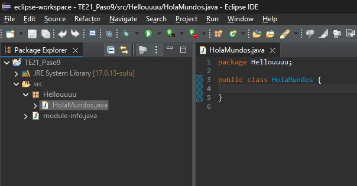

   - Cambia la versión de Java del proyecto para que utilize la versión de Java 8. (Muestra una captura de pantalla)

      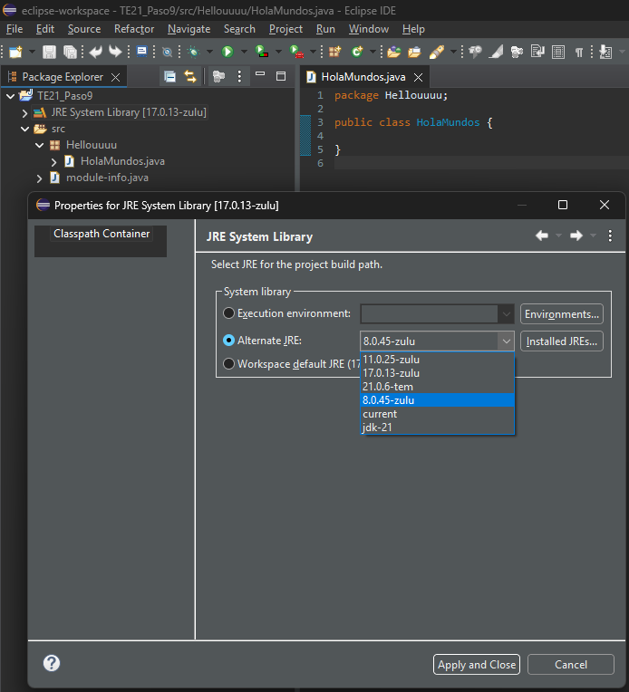

      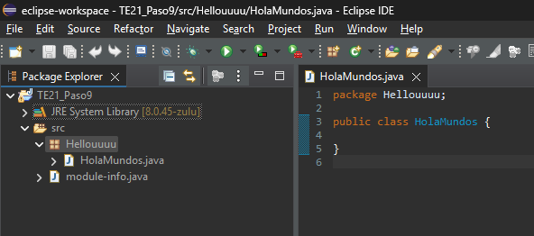

### 3. Utilización de JetBrains IntelliJ IDEA y Eclipse

10. Crea un nuevo proyecto en IntelliJ IDEA (TE21-Paso10) y configura en ese directorio, con SDKMAN para que utilize la versión de Java 11.

   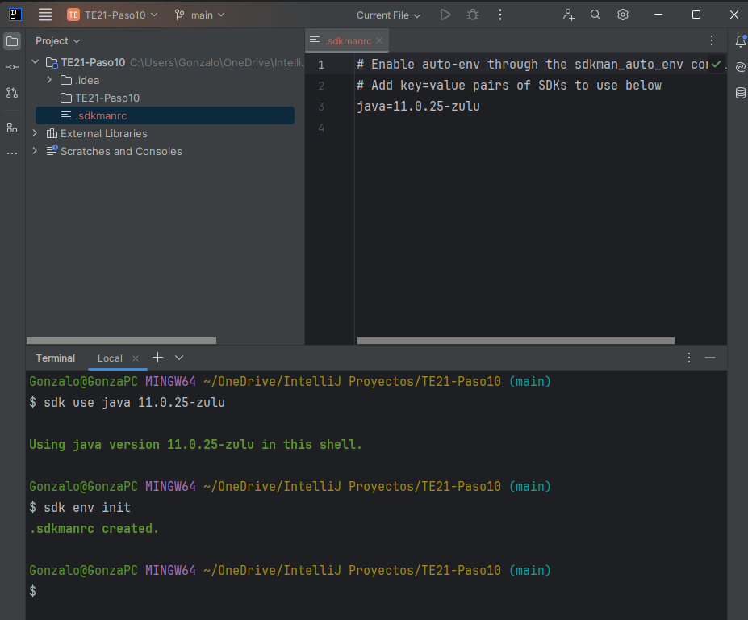

- Ahora al abrir IntellJ IDEA, debe activar esa versión automaticamente, pues detectar la configuración. (Incluye una captura de panntalla o GIF de la configuración)

   

11. Importar el proyecto TE21-Paso9 en IntelliJ IDEA que has creado en Eclipse.

         Para realizar este paso, ademas de abrir el proyecto desde Intell IJ, debemos de referencias la dependencia a un modulo externo.

   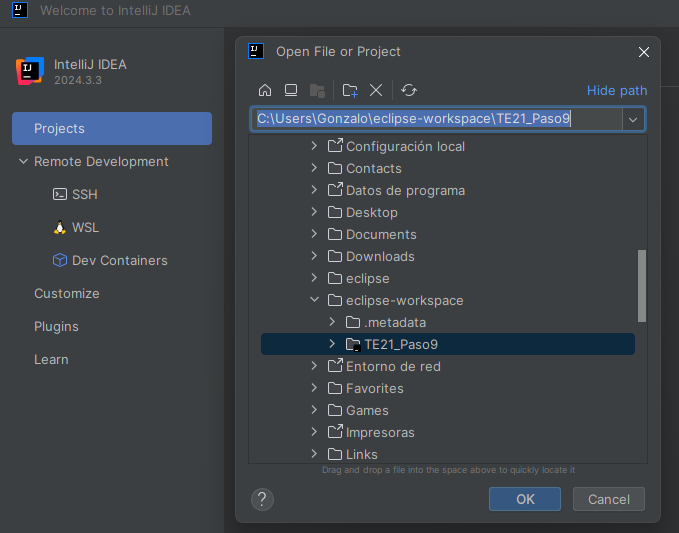

         Ademas, se puede concretar y señalar que proviene de Eclipse.

   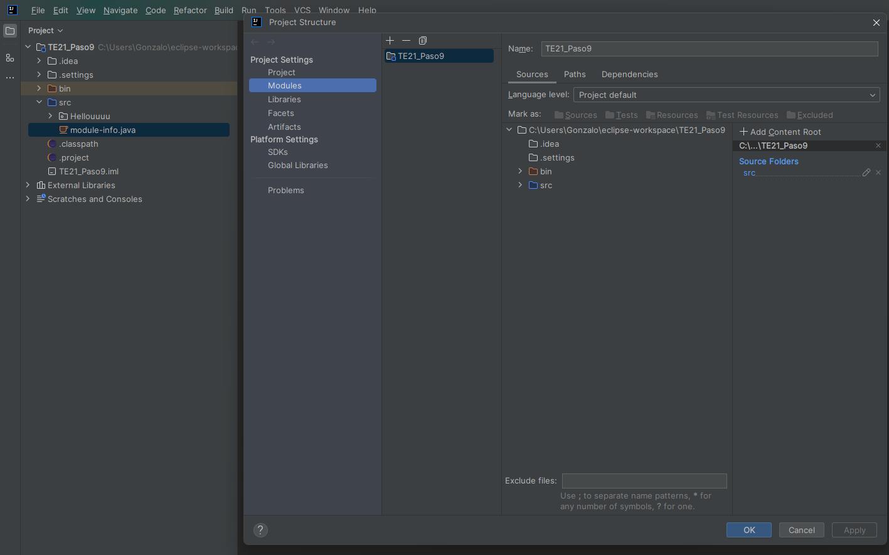

- Revisa la configuración de la versión de Java que utiliza el proyecto ¿Es la misma que utiliza Eclipse?. (Muestra una captura de pantalla)

      No, no es la misma configuración. La que se ha activado es la version DEFAULT del SDKMAN. Que es la que esta selecionada como predeterminada para Intell IJ
  
  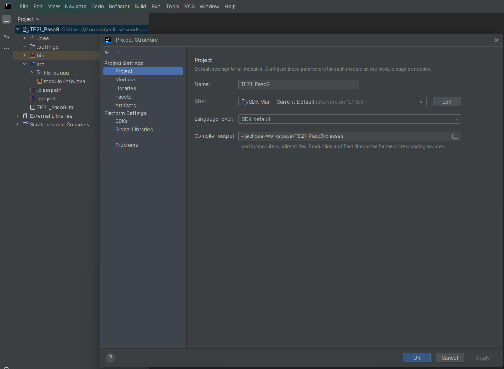
  
  Explica según tu opinión y en base a la configuración aplicada al proyecto de Eclipse realizada en el paso 9, si debe ser la misma versión de JDK en ambos proyectos o si esto depende de otras configuraciones extenas al proyecto.

      En mi opinión, el proceso es correcto. Ya que a cada IDE le hemos dado unas configuraciones por defecto. Salvo que se encuentren un archivo .sdkmanrc que les indique lo contrario. Y en concreto, para el proyecto eclipse, no creamos dicho archivo de configuración.

   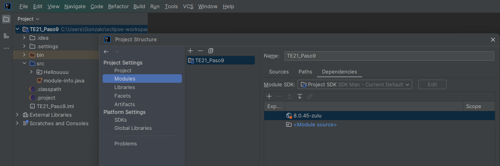

      Ademas, podemos observar en las dependencias del Modulo importado de Eclipse, se indica que este a su vez depende de la SDK 8-zulu.

12. Crea un nuevo proyecto en IntelliJ IDEA (TE21-Paso12) que se guarde en la carpeta TE21-Paso12.

- Configura el proyecto para que utilice la versión de Java 17 descargada con SDKMAN. (Muestra una captura de pantalla de la configuración del fichero .sdkmanrc)
   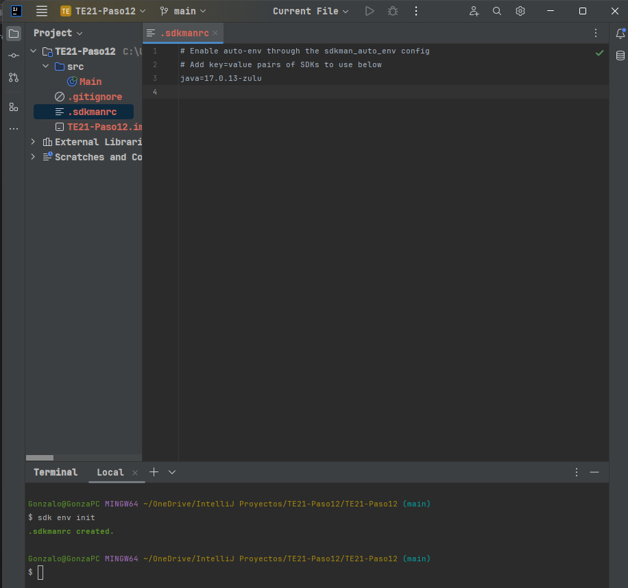
- Agrega otro módulo al proyecto, que se guarde en la carpeta Modulo2.
- Agrega otro módulo al proyecto, que se guarde en la carpeta Modulo3.

(Muestra una captura de pantalla de la estructura del proyecto en IntelliJ IDEA)
   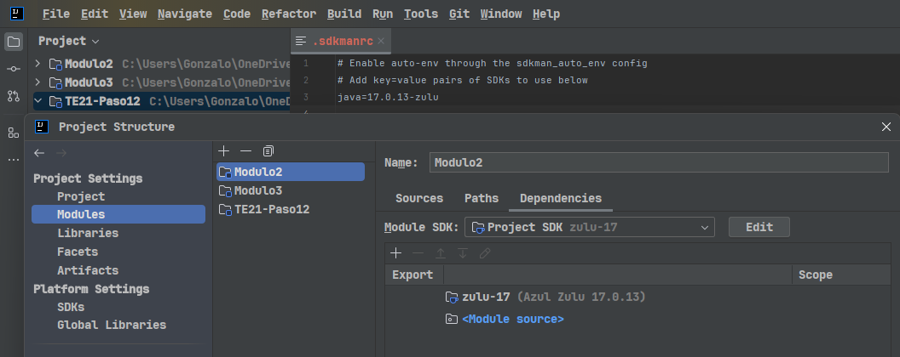
- Vincula el proyecto principal, con los módulos 2 y 3. (Muestra una captura de pantalla de la configuración de los módulos)
   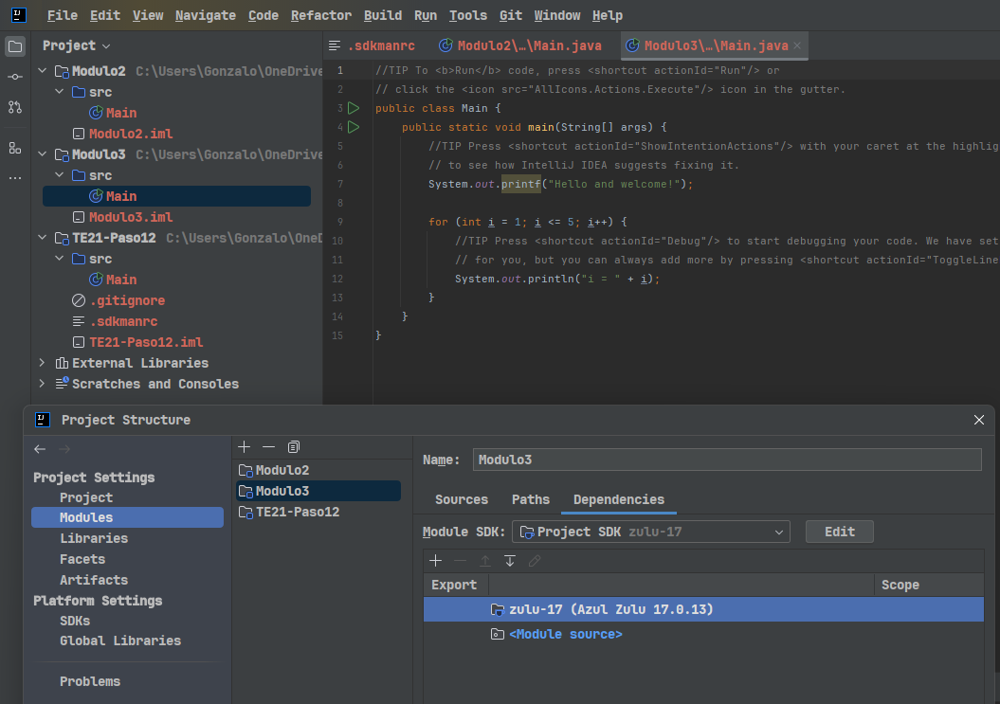

13. En el módulo 2, crea una clase que se llame `Utilidades` y que tenga un método que se llame `calculadora` y que tenga los métodos de suma, resta, multiplicación y división.

(Muestra el código de la clase `Utilidades` con un bloque de código)
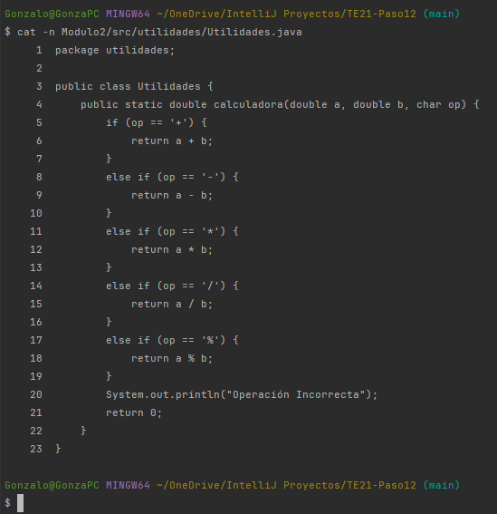

14. En el módulo 3, crea una clase llamada `Conversor` que tenga un método que se llame `Texto_to_Uppercase` que convierta un texto a mayúsculas, y otro método que se llame `Texto_to_Lowercase` que convierta un texto a minúsculas.

(Muestra el código de la clase `Conversor` con un bloque de código)
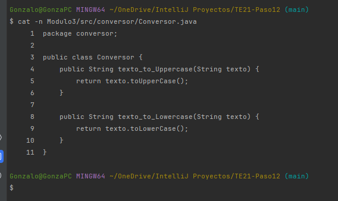

15. En el módulo principal, crea una clase llamada `Principal` que tenga un método `main` que instancie las clases `Utilidades` y `Conversor` y que muestre por consola el resultado de las operaciones de la clase `Utilidades` y el resultado de las operaciones de la clase `Conversor`.

(Muestra un gif donde se muestre la ejecución del programa, en depuración y se visualice que no existen errores de compilación ni ejecución).
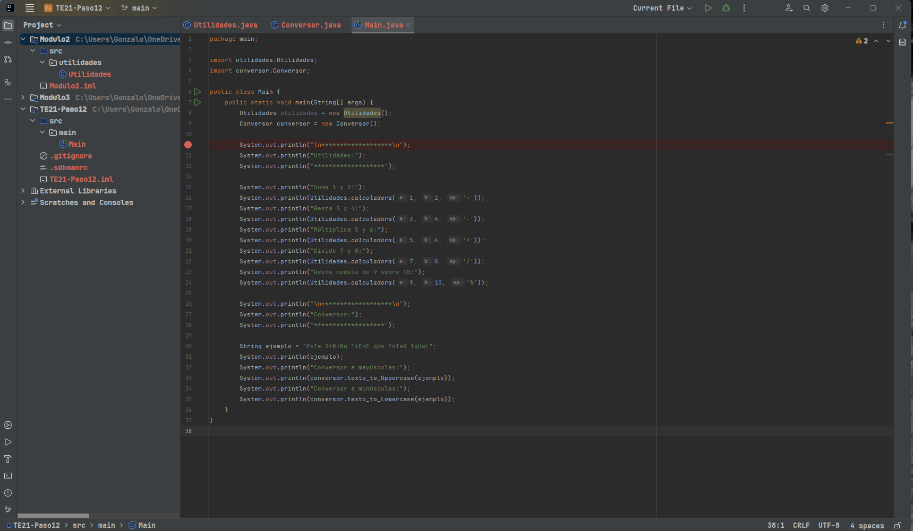