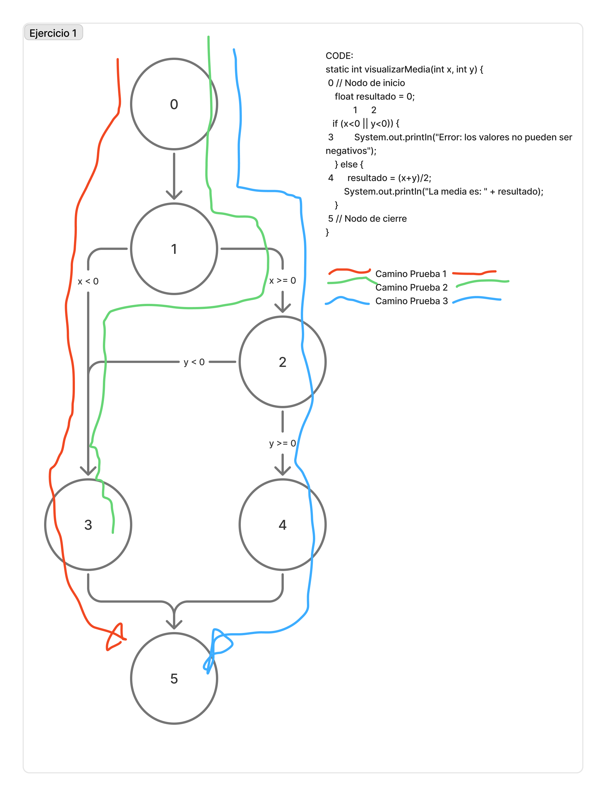
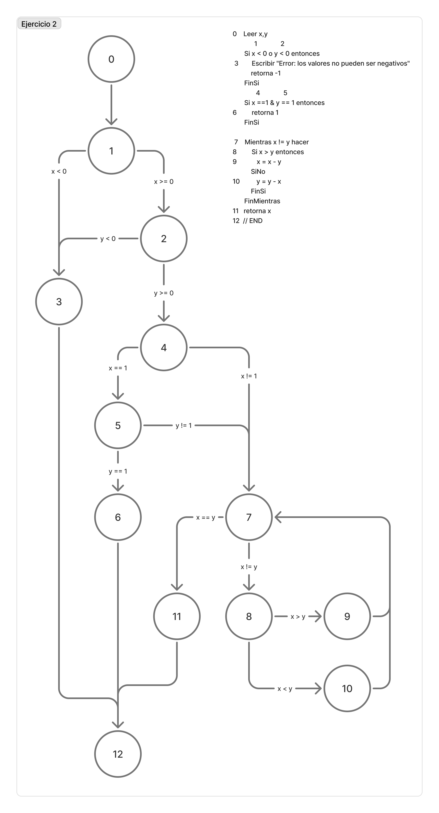
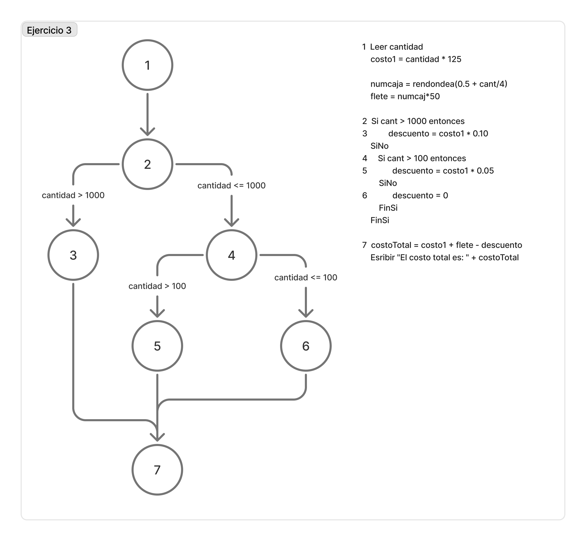
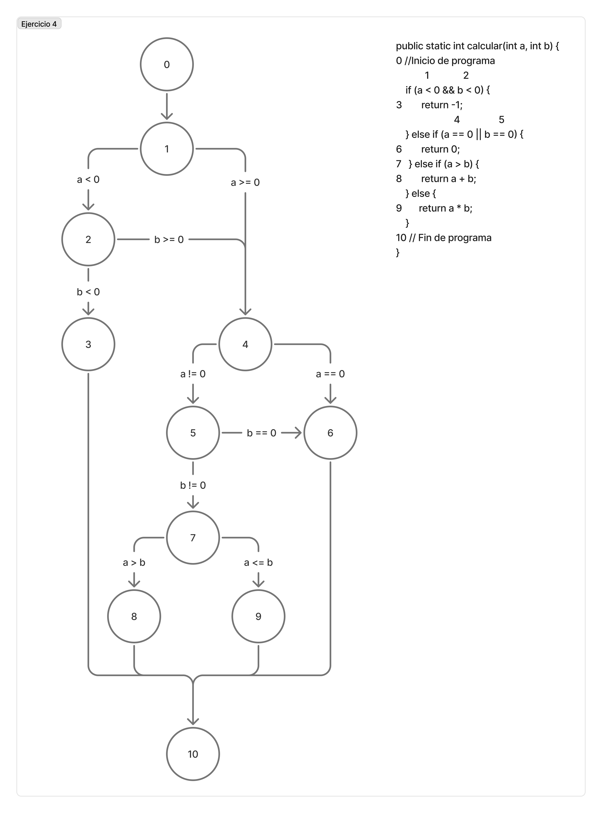
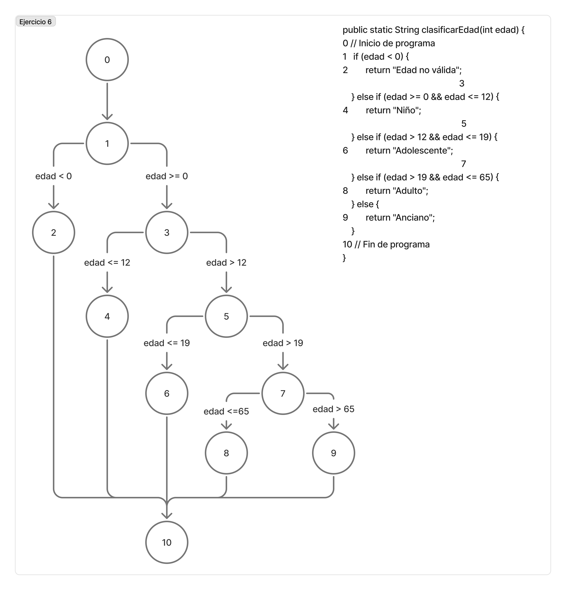

# Tarea evaluable 4.2. Análisis de Algoritmos y Complejidad Ciclomática

### Entrega

En tu repositorio de GitHub, crea una carpeta llamada `UT4` y dentro de ella una subcarpeta llamada `TE4.2`. En esta última, añade un archivo llamado `readme.md` donde copiarás el contenido de este documento. Completa las partes del ejercicio que se indican y entrega el link a tu repositorio en Moodle.

Las imágenes guardalas en la carpeta `UT4\TE4.1\_res\img`.


### Recursos

- [Concepto de Complejidad Ciclomática](https://juncotic.com/complejidad-ciclomatica/)
- [Herramienta crear grafo de flujo: Figma con FigJam](https://www.figma.com/figjam/) Igual que en el tema de los diagramas de flujo.
- [**Ejemplo de grafo de flujo**](https://www.figma.com/board/gYs2svynnBkcx2aLP037LG/Ejemplo.GrafoFlujo.ComplejidadCiclomatica?node-id=0-1&t=nfiEGZFmyGRG6aZO-1) usar como ejemplo para crear el grafo de flujo de los ejercicios.
- [**Práctica guiada con ejercicios de ejemplo resueltos**](https://github.com/jssfpciclos/DAW_eedd/blob/main/UT3/CS/EC31_Caso-practico-pruebas-caja-blanca.md)


## Enunciado

Para realizar cada uno de estos ejercicios, por un lado tienes que 

- Adjuntar una imagen del grafo de flujo asociado al fragmento de programa, con los caminos marcados. (Exportar imagen de Figma)
- Indicar en el fragmento de programa a qué parte del grafo de flujo corresponde cada línea de código.
- Calcular la complejidad ciclomática del grafo.
- Indicar la tabla de pruebas necesaria para alcanzar la cobertura de caminos, indicando los caminos y las pruebas necesarias.


## Ejercicio 1

Dado el siguiente fragmento de programa en Java: (Indicar el número de línea de cada parte del grafo de flujo)

```java
static void visualizarMedia(int x, int y) {
    0 // Nodo de inicio
           float resultado;
                1      2
           if (x<0 || y<0) {
    3                 System.out.println("Error: los valores no pueden ser negativos");
        } else {
    4       resultado =((float) (x+y))/ 2f;
            System.out.println("La media es: " + resultado);
        }
    5 // Nodo de cierre
    }
```

**Se pide:**

1. Obtener el grafo de flujo asociado al fragmento de programa.
   

2. Calcular la complejidad ciclomática del grafo.
   ```text
    V(G) ≡ f(E,N,P) = E - N + 2P = 7 - 6 + 2*1 = 3
    E = 7 ≡ Nº de aristas
    N = 6 ≡ Nº de nodos
    P = 1 ≡ Nº componentes conexos
    ```

3. En base a la complejidad calculada, indica la tabla de pruebas necesaria para alcanzar la cobertura de caminos.

- Indica las pruebas necesarias junto con los caminos que se deben recorrer para alcanzar la cobertura de caminos.
  (Rellena la siguiente tabla, donde se indica el nombre del caso de prueba, el camino, las condiciones de cada variable o condición, y el resultado esperado)
  
    ```text
    | Caso de prueba | Camino    | Condiciones | Resultado esperado                         |
    |----------------|-----------|-------------|--------------------------------------------|
    | CP1            | 0-1-3-5   | x<0 , y>=0  | Error: los valores no pueden ser negativos |
    | CP2            | 0-1-2-3-5 | x>=0, y<0   | Error: los valores no pueden ser negativos |
    | CP3            | 0-1-2-4-5 | x>=0, y>=0  | La media es: resultado                     |
    ```
    
  

## Ejercicio 2

A partir del siguiente algoritmo en pseudocódigo, se pide:

```java
Leer x,y
Si x < 0 o y < 0 entonces
    Escribir "Error: los valores no pueden ser negativos"
    retorna -1
FinSi

Si x ==1 y y == 1 entonces
    retorna 1
FinSi

Mientras x != y hacer
    Si x > y entonces
        x = x - y
    SiNo
        y = y - x
    FinSi
FinMientras

retorna x
```

**Se pide:**

1. Obtener el grafo de flujo asociado al fragmento de programa.
   

2. Calcular la complejidad ciclomática del grafo.
   ```text
    V(G) ≡ f(E,N,P) = E - N + 2P = 19 - 13 + 2*1 = 8
    E = 19 ≡ Nº de aristas
    N = 13 ≡ Nº de nodos
    P = 1 ≡ Nº componentes conexos
    ```

3. En base a la complejidad calculada, indica la tabla de pruebas necesaria para alcanzar la cobertura de caminos.
  
    ```text
    | Caso | Camino                       | Condiciones    | Resultado esperado                                           |
    |------|------------------------------|----------------|--------------------------------------------------------------|
    | CP1  | 0-1-3-12                     | x<0 ,     y>=0 | Mensaje de error + Valor de retorno(-1)                      |
    | CP2  | 0-1-2-3-12                   | x>=0,     y<0  | Mensaje de error + Valor de retorno(-1)                      |
    | CP3  | 0-1-2-4-5-6-12               | x==1,     y==1 | Valor de retorno(1)                                          |
    | CP3  | 0-1-2-4-5-7-8-10-...-7-11-12 | x==1,     y>1  | Entra en el bucle y hay convergencia x=y => Devuelve(x)      |
    | CP4  | 0-1-2-4-7-8-9-...-7-11-12    | x>1,      y==1 | Entra en el bucle y hay convergencia x=y => Devuelve(x)      |
    | CP5  | 0-1-2-4-7-11-12              | x>1,      x==y | No entra en el bucle y hay convergencia x=y => Devuelve(x)   |
    | CP6  | 0-1-2-4-7-8-10-...-7-11-12   | x>1,      y>x  | Entra en el bucle y hay convergencia x=y => Devuelve(x)      |
    | CP7  | 0-1-2-4-7-8-9-...-7-11-12    | y>1,      x>y  | Entra en el bucle y hay convergencia x=y => Devuelve(x)      |
    | CP8  | 0-1-2-4-7-8-....             | x>1, y>1, x!=y | Entra en el bucle y NO hay convergencia x=y => Bucle infinito|
    ```


4. Fragmento de Java, algoritmo (método completo):
```java
public int pruebasCiclomaticas2 (int x, int y) {

    if (x < 0 || y < 0) {
        System.out.println("Error: Los valores no pueden ser negativos");
        return -1;
        
    } else if (x == 1 && y == 1) {
        return 1;
        
    } else {
        while (x != y) {
            if (x>y) {
                x = x - y;
            } else {
                y = y - x;
            }
        }

        return x;
    }         
}
```

## Ejercicio 3

A partir del siguiente algoritmo en pseudocódigo, se pide:

```java
Leer cantidad
costo1 = cantidad * 125

numcaja = rendondea(0.5 + cant/4)
flete = numcaj*50

Si cant > 1000 entonces
    descuento = costo1 * 0.10
SiNo
    Si cant > 100 entonces
        descuento = costo1 * 0.05
    SiNo
        descuento = 0
    FinSi
FinSi

costoTotal = costo1 + flete - descuento

Esribir "El costo total es: " + costoTotal
```

**Se pide:**

1. Obtener el grafo de flujo asociado al fragmento de programa.
   

2. Calcular la complejidad ciclomática del grafo.
   ```text
    V(G) ≡ f(E,N,P) = E - N + 2P = 8 - 7 + 2*1 = 3
    E = 8 ≡ Nº de aristas
    N = 7 ≡ Nº de nodos
    P = 1 ≡ Nº componentes conexos
    ```

3. En base a la complejidad calculada, indica la tabla de pruebas necesaria para alcanzar la cobertura de caminos.

    ```text
    | Caso de prueba | Camino    | Condiciones             | Resultado esperado           |
    |----------------|-----------|-------------------------|------------------------------|
    | CP1            | 1-2-3-7   |         cantidad > 1000 | Costo total con dto. del 10% |
    | CP2            | 1-2-4-5-7 | 1000 >= cantidad > 100  | Costo total con dto. del 5%  |
    | CP3            | 1-2-4-6-7 | 100 >= cantidad         | Costo total sin dto.         |
    ```


### Ejericio 4

A partir del siguiente método de programa en Java (incluir condiciones && y retornos directos), se pide:

```java
public static int calcular(int a, int b) {
    if (a < 0 && b < 0) {
        return -1;
    } else if (a == 0 || b == 0) {
        return 0;
    } else if (a > b) {
        return a + b;
    } else {
        return a * b;
    }
}
```

**Se pide:**

1. Obtener el grafo de flujo asociado al fragmento de programa.
   

2. Calcular la complejidad ciclomática del grafo.
   ```text
    V(G) ≡ f(E,N,P) = E - N + 2P = 15 - 11 + 2*1 = 6
    E = 15 ≡ Nº de aristas
    N = 11 ≡ Nº de nodos
    P = 1 ≡ Nº componentes conexos
    ```

3. En base a la complejidad calculada, indica la tabla de pruebas necesaria para alcanzar la cobertura de caminos.

    ```text
    | Caso | CONDICIONES    | Camino           | Resultado |
    | CP1  | a < 0,  b < 0  | 0-1-2-3-10       |    -1     |
    | CP2  | a < 0,  b = 0  | 0-1-2-4-5-6-10   |     0     |
    | CP3  | a < 0,  b > 0  | 0-1-2-4-5-7-9-10 |    a*b    |
    | CP4  | a = 0,  b != 0 | 0-1-4-6-10       |     0     |
    | CP5  | a > 0,  b = 0  | 0-1-4-5-6-10     |     0     |
    | CP6  | a > 0,  a>b>0  | 0-1-4-5-7-8-10   |    a+b    |
    ```


### Ejercicio 5 (Resuelto)

En este ejercicio se trabajan las clases de equivalencia y los valores límite. A partir del siguiente método de programa en Java, se pide:

(genera un método original, no copiar el de la práctica guiada)

```java
public static String clasificarNumero(int numero) {
    if (numero < 0) {
        return "Negativo";
    } else if (numero == 0) {
        return "Cero";
    } else if (numero > 0 && numero <= 10) {
        return "Pequeño";
    } else if (numero > 10 && numero <= 100) {
        return "Mediano";
    } else {
        return "Grande";
    }
}
```

En base a este método, las clases de equivalencia y los valores límite serían los siguientes:

```text
| Clase de equivalencia | Valores límite |
|-----------------------|----------------|
| Negativo              | -1, -10        |
| Cero                  | 0              |
| Pequeño               | 1, 5, 10       |
| Mediano               | 11, 50, 100    |
| Grande                | 101, 200       |
```

### Ejercicio 6

En base al siguiente método de programa en Java, se pide:

```java
public static String clasificarEdad(int edad) {
    if (edad < 0) {
        return "Edad no válida";
    } else if (edad >= 0 && edad <= 12) {
        return "Niño";
    } else if (edad > 12 && edad <= 19) {
        return "Adolescente";
    } else if (edad > 19 && edad <= 65) {
        return "Adulto";
    } else {
        return "Anciano";
    }
}
```

**Se pide:**

1. Obtener el grafo de flujo asociado al fragmento de programa.
   
    Nota: en este caso en particular, no se contemplan los dobles condicionales (condiciones &&), por ser la 1ª parte redundante.

2. Calcular la complejidad ciclomática del grafo.
   ```text
    V(G) ≡ f(E,N,P) = E - N + 2P = 14 - 11 + 2 = 5 
    E = 14 ≡ Nº de aristas
    N = 11 ≡ Nº de nodos
    P = 1 ≡ Nº componentes conexos
    ```

3. Indica las clases de equivalencia y los valores límite para el método `clasificarEdad`.
   ```text
   | Clase de equivalencia | Valores límite |
   |-----------------------|----------------|
   | Edad no valida        |    -1          |
   | Niño                  |    0,      12  |
   | Adolescente           |    13,  19     |
   | Adulto                |    20,     65  |
   | Anciano               |    66          |
   ```


  