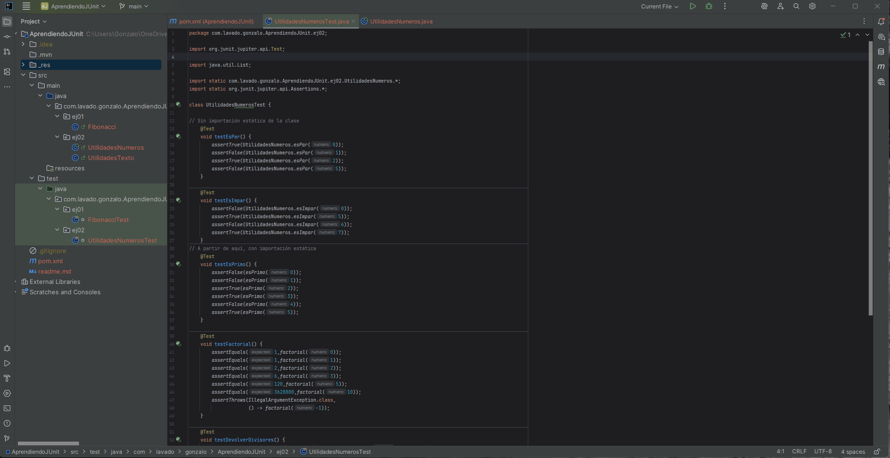
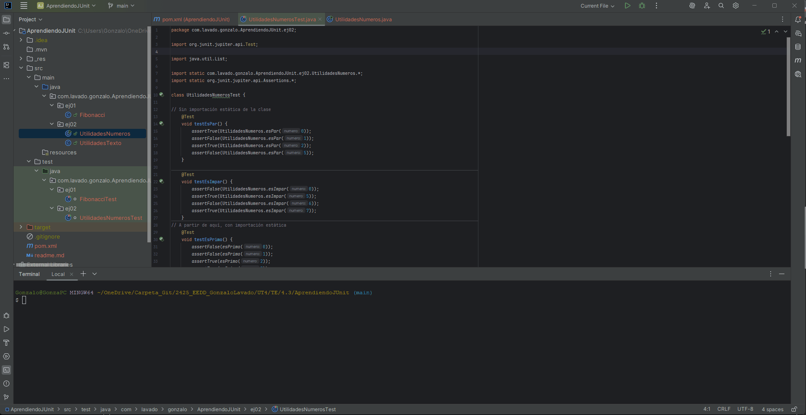
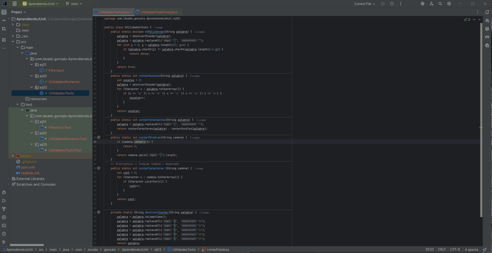
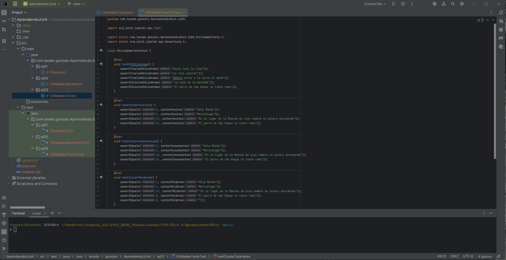

# Tarea evaluable 4.3. Unit Testing con JUnit 5

En esta tarea evaluable se van a realizar una serie de ejercicios para practicar el uso de JUnit 5. Para su realización se recomienda seguir los siguientes pasos:

- Todos los ejercicios se entregan dentro de un proyecto de IntelliJ.
- El proyecto debe ser gestionado por Maven.
- Copiar este fichero `readme.md` en la raiz del proyecto.
- Nombre del proyecto: `AprendiendoJUnit`.
- Paquete raiz del proyecto: `com.{apellido1.nombre}.AprendiendoJUnit`.

### Entrega

- El proyecto debe crearse dentro de la ruta `UT4/TE4.3/` de vuestro repositorio.
- Copiar el enlace a la carpeta `UT4/TE4.3/` y pegar en el formulario de entrega de la tarea evaluable.


### Recursos

- [JUnit 5 User Guide](https://junit.org/junit5/docs/current/user-guide/)
- [Curso de JUnit 5](https://www.youtube.com/playlist?list=PLTd5ehIj0goPcVH3xhSudzyazW8CtMvsq)
- [Maven in 5 Minutes](https://maven.apache.org/guides/getting-started/maven-in-five-minutes.html)


### Crear proyecto Maven

Crear un proyecto Maven con las siguientes características:
- **`groupId`**: `com.{apellido1}.{nombre}`.
- **`artifactId`**: `AprendiendoJUnit`.
- **`version`**: `1.0-SNAPSHOT`.
- **`packaging`**: `jar`.
- **`name`**: `AprendiendoJUnit`.
- **`description`**: `Aprendiendo JUnit 5`.

Una vez creado el proyecto, añadir las siguientes dependencias al archivo `pom.xml`:

```xml
<dependencies>
    <!-- Dependencia principal de JUnit 5 (Jupiter) -->
    <dependency>
        <groupId>org.junit.jupiter</groupId>
        <artifactId>junit-jupiter</artifactId>
        <version>5.10.0</version>
        <scope>test</scope>
    </dependency>
</dependencies>
```

Y con esto ya tendrías el proyecto creado y listo para empezar a trabajar con JUnit 5.

JUnit5 utiliza una serie de anotaciones para indicar los métodos que son pruebas, y para indicar el comportamiento de las pruebas. Las más importantes son:

- `@Test`: Indica que el método es una prueba.
- `@BeforeEach`: Indica que el método se ejecuta antes de cada prueba.
- `@AfterEach`: Indica que el método se ejecuta después de cada prueba.
- `@BeforeAll`: Indica que el método se ejecuta una vez antes de todas las pruebas.
- `@AfterAll`: Indica que el método se ejecuta una vez después de todas las pruebas.
- `@DisplayName`: Indica el nombre de la prueba.
- `@Disabled`: Indica que la prueba está deshabilitada y no se ejecutará.


### Ejercicio 1 (Resuelto). Fibonacci

La sucesión de Fibonacci es una sucesión matemática en la que cada número es la suma de los dos anteriores. La sucesión comienza con 0 y 1, y los siguientes números son 1, 2, 3, 5, 8, 13, 21, etc.

Dentro del paquete `com.{apellido1.nombre}.AprendiendoJUnit.ej01` crear la clase `Fibonacci` que implementa el cálculo de la serie de Fibonacci. La implementación es la siguiente:


```java	

/// Clase que implementa el cálculo de la serie de Fibonacci
public class Fibonacci {
	public int fib(int n) {
		if(n == 0) {
			return 0;
		}
		if(n == 1 || n == 2) {
			return 1;
		}
		return fib(n-2) + fib(n-1);
	}
}
```

Para poder comprobar que la implementación es correcta, se deben realizar una serie de comprobaciones, en base a una serie de casos de prueba. En base al código los casos de prueba son los siguientes:

- Comprobar que el resultado de `fib(0)` es 0.
- Comprobar que el resultado de `fib(1)` es 1.
- Comprobar que el resultado de `fib(2)` es 1.
- Comprobar que el resultado de `fib(3)` es 2.
- Comprobar que el resultado de `fib(4)` es 3.
- Comprobar que el resultado de `fib(5)` es 5.
- Comprobar que el resultado de `fib(8)` es 21.
- Comprobar que el resultado de `fib(10)` es 55.
- Comprobar que el resultado de `fib(13)` es 233.
- Comprobar que el resultado de `fib(15)` es 610.
- Comprobar que el resultado de `fib(20)` es 6765.
- Comprobar que el resultado de `fib(25)` es 75025.

Y así sucesivamente. Con estos casos de prueba se puede comprobar que la implementación es correcta.


Se pide:

- Crear una clase FibonacciTest (dentro del paquete `com.{apellido1.nombre}.AprendiendoJUnit.ej01`) y en el directorio `src/test/java`.
- Crear un método `setUp` que se llame una vez por cada test, y que instancia la clase `Fibonacci`
- Crear un método `tearDown` que se llame una vez por cada test, y que ponga a null la instancia de la clase `Fibonacci`
- Crear los siguientes métodos de test (utiliza la anotación `@DisplayName` para indicar el nombre del test):
    - `testFib0`
    - `testFib1`
    - `testFib2`
    - `testFib3`
    - `testFib4`
    - `testFib5`
    - `testFib8`
    - `testFib10`
    - `testFib13`
    - `testFib15`
    - `testFib20`
    - `testFib25`

- En cada uno de los métodos de test, comprobar que el resultado de la llamada al método `fib` es el esperado. Para ello, utilizar el método `assertEquals` de JUnit 5.


**RESOLUCIÓN DEL EJERCICIO:**


Creamos la clase `FibonacciTest` dentro del paquete `com.{apellido1.nombre}.AprendiendoJUnit.ej01` y en el directorio `src/test/java`.

```java
package com.{apellido1.nombre}.AprendiendoJUnit.ej01;

import static org.junit.jupiter.api.Assertions.assertEquals;
import org.junit.jupiter.api.BeforeEach;

@DisplayName("Test para la clase fib")
class FibonacciTest {

    private Fibonacci calculator;

    @BeforeEach
    void setUp() {
        calculator = new Fibonacci();
    }

    @Test
    @DisplayName("Fibonacci de 0 debe ser 0")
    void testFibonacciZero() {
        assertEquals(0, calculator.fib(0));
    }

    @Test
    @DisplayName("Fibonacci de 1 debe ser 1")
    void testFibonacciOne() {
        assertEquals(1, calculator.fib(1));
    }

    @Test
    @DisplayName("Fibonacci de 5 debe ser 5")
    void testFibonacciFive() {
        assertEquals(5, calculator.fib(5));
    }

    // Añadir los demás métodos de test aquí
    @AfterEach
    void tearDown() {
        calculator = null;
    }
}
```

Si quisieramos comprobar que se lanza una excepción, se puede utilizar el método `assertThrows` de JUnit 5. Por ejemplo:

```java
@Test
@DisplayName("Lanzar excepción si el número es negativo")
void testNegativeNumber() {
    assertThrows(IllegalArgumentException.class, () -> calculator.fib(-1));
}
```	

En este caso, se comprueba que si se pasa un número negativo a la función `fib`, se lanza una excepción `IllegalArgumentException`.

**Método `setUp` y `tearDown`:**

El método `setUp` se ejecuta antes de cada prueba y crea una nueva instancia de la clase `Fibonacci`. El método `tearDown` se ejecuta después de cada prueba y pone a null la instancia de la clase `Fibonacci`. Esto es útil para asegurarse de que cada prueba se ejecuta en un entorno limpio y no afecta a las demás pruebas.

*Ejecutar desde IntelliJ*

Para ejecutar las pruebas desde IntelliJ, hacer clic derecho en la clase `FibonacciTest` y seleccionar "Run 'FibonacciTest'". Esto ejecutará todas las pruebas de la clase y mostrará los resultados en la ventana de resultados de pruebas.

Para ejecutar desde Maven, abrir una terminal y ejecutar el siguiente comando:

```bash
mvn test
```
Esto ejecutará todas las pruebas del proyecto y mostrará los resultados en la terminal.

Y de esta forma ya habremos realizado nuestro primer test con JUnit. Ahora esta clase `FibonacciTest` siempre nos protegerá ante posibles cambios, y no hará falta que ejecutemos estas pruebas manualmente.


### Ejercicio 2. UtilidadesNumeros

Copia la clase `UtilidadesNumeros` del ejercicio 3.4 dentro del paquete `com.{apellido1.nombre}.AprendiendoJUnit.ej02` y en el directorio `src/main/java`.

La clase `UtilidadesNumeros` tiene los siguientes métodos:

- `esPrimo(int numero)`: Devuelve true si el número es primo, false en caso contrario.
- `esPar(int numero)`: Devuelve true si el número es par, false en caso contrario.
- `esImpar(int numero)`: Devuelve true si el número es impar, false en caso contrario.
- `esPerfecto(int numero)`: Devuelve true si el número es perfecto, false en caso contrario.
- `factorial(int numero)`: Devuelve el factorial del número.
- `devolverDivisores(int numero)`: Devuelve un array con los divisores del número.


Crea una clase `UtilidadesNumerosTest` dentro del paquete `com.{apellido1.nombre}.AprendiendoJUnit.ej02` y en el directorio `src/test/java`.

Debes probar los siguientes casos de prueba:

- `esPar` (crear método `testEsPar` y comprobar los siguientes casos):
  - Comprobar que el número 0 es par.
  - Comprobar que el número 1 NO es par.
  - Comprobar que el número 4 es par.
  - Comprobar que el número 5 NO es impar.
  
- `esImpar` (crear método `testEsImpar`):
  - Comprobar que el número 0 no es par.
  - Comprobar que el número 5 es impar.
  - Comprobar que el número 6 no es impar.
  - Comprobar que el número 7 es impar.
  
- `esPrimo` (crear método `testEsPrimo`):
  - Comprobar que el número 0 no es primo.
  - Comprobar que el número 1 no es primo.
  - Comprobar que el número 2 es primo.
  - Comprobar que el número 3 es primo.
  - Comprobar que el número 4 no es primo.
  - Comprobar que el número 5 es primo.
  
- `esPerfecto` (crear método `testEsPerfecto`):
  - Comprobar que el número 0 no es perfecto.
  - Comprobar que el número 5 no es perfecto.
  - Comprobar que el número 6 es perfecto.
  - Comprobar que el número 9 no es perfecto.
  - Comprobar que el número 10 no es perfecto.
  - Comprobar que el número 28 es perfecto.
  - Comprobar que el número 496 es perfecto.

- `factorial` (crear método `testFactorial`):
  - Comprobar que el factorial de -1 lanza excepción `IllegalArgumentException`.
  - Comprobar que el factorial de 0 es 1.
  - Comprobar que el factorial de 1 es 1.
  - Comprobar que el factorial de 2 es 2.
  - Comprobar que el factorial de 3 es 6.
  - Comprobar que el factorial de 5 es 120.
  - Comprobar que el factorial de 10 es 3628800.
  

- `devolverDivisores` (crear método `testDevolverDivisores`):
  - Comprobar que el número 0 no tiene divisores.
  - Comprobar que el número 1 no tiene divisores.
  - Comprobar que el número 2 tiene como divisor 1 y 2.
  - Comprobar que el número 3 tiene como divisor 1 y 3.
  - Comprobar que el número 4 tiene como divisor 1, 2 y 4.
  - Comprobar que el número 5 tiene como divisor 1 y 5.

> Nota: Para comprobar una lista de enteros, se puede utilizar el método `assertArrayEquals` de JUnit 5. Por ejemplo:
>  
> `assertArrayEquals(new int[]{1, 2}, UtilidadesNumeros.devolverDivisores(2));`

> 🧲  Adjuntar un GIF donde se visualize que el resultado de pasar los test a la clase `UtilidadesNumerosTest` en IntelliJ.


> 🧲  Adjuntar un GIF donde se visualize que el resultado de pasar los test en Maven a la clase `UtilidadesNumerosTest` en IntellJ.


### Ejercicio 3. UtilidadesTexto

Copia la clase `UtilidadesTexto` del ejercicio 3.4 dentro del paquete `com.{apellido1.nombre}.AprendiendoJUnit.ej03` y en el directorio `src/main/java`.

La clase `UtilidadesTexto` tiene los siguientes métodos:

- `esPalindromo(String texto)`: Devuelve true si el texto es un palíndromo, false en caso contrario.
- `contarVocales(String texto)`: Devuelve el número de vocales del texto.
- `contarConsonantes(String texto)`: Devuelve el número de consonantes del texto.
- `contarPalabras(String texto)`: Devuelve el número de palabras del texto.
- `contarCaracteres(String texto)`: Devuelve el número de caracteres del texto.


Crea una clase `UtilidadesTextoTest` dentro del paquete `com.{apellido1.nombre}.AprendiendoJUnit.ej03` y en el directorio `src/test/java`.

Debes probar los siguientes casos de prueba:

- `esPalindromo` (crear método `testEsPalindromo` y comprobar los siguientes casos):
  - Comprobar que el texto "Anita lava la tina" es un palíndromo.
  - Comprobar que el texto "La ruta natural" es un palíndromo.
  - Comprobar que el texto "Dábale arroz a la zorra el abad" es un palíndromo.
  - Comprobar que el texto "La casa de la montaña" no es un palíndromo.
  - Comprobar que el texto "El perro de San Roque no tiene rabo" no es un palíndromo.


- `contarVocales` (crear método `testContarVocales`):
    - Comprobar que el texto "Hola Mundo" tiene 4 vocales.
    - Comprobar que el texto "Murcielago" tiene 5 vocales.
    - Comprobar que el texto "En un lugar de la Mancha de cuyo nombre no quiero acordarme" tiene 15 vocales.
    - Comprobar que el texto "El perro de San Roque no tiene rabo" tiene 10 vocales.
  

- `contarConsonantes` (crear método `testContarConsonantes`):
    - Comprobar que el texto "Hola Mundo" tiene 6 consonantes.
    - Comprobar que el texto "Murcielago" tiene 5 consonantes.
    - Comprobar que el texto "En un lugar de la Mancha de cuyo nombre no quiero acordarme" tiene 25 consonantes.
    - Comprobar que el texto "El perro de San Roque no tiene rabo" tiene 16 consonantes.
  

- `contarPalabras` (crear método `testContarPalabras`):
    - Comprobar que el texto "Hola Mundo" tiene 2 palabras.
    - Comprobar que el texto "Murcielago" tiene 1 palabra.
    - Comprobar que el texto "En un lugar de la Mancha de cuyo nombre no quiero acordarme" tiene 17 palabras.
    - Comprobar que el texto "El perro de San Roque no tiene rabo" tiene 10 palabras.
    - Comprobar que el texto " " tiene 0 palabras.

- `contarCaracteres` (crear método `testContarCaracteres`):
    - Comprobar que el texto "Hola Mundo" tiene 10 caracteres.
    - Comprobar que el texto "Murcielago" tiene 10 caracteres.
    - Comprobar que el texto "En un lugar de la Mancha de cuyo nombre no quiero acordarme" tiene 70 caracteres.
    - Comprobar que el texto "El perro de San Roque no tiene rabo" tiene 38 caracteres.
    - Comprobar que el texto " " tiene 0 caracteres.	


> 🧲  Adjuntar un GIF donde se visualize que el resultado de pasar los test a la clase `UtilidadesTextosTest` en IntellJ.



> 🧲  Adjuntar un GIF donde se visualize que el resultado de pasar los test en Maven a la clase `UtilidadesTextosTest` en IntellJ.
